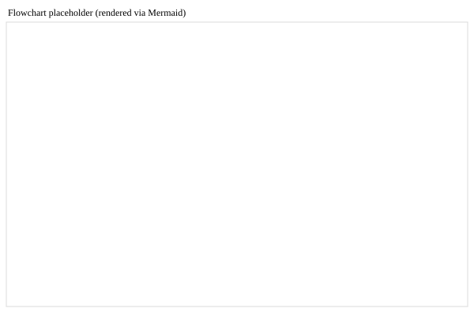
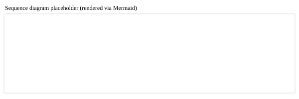
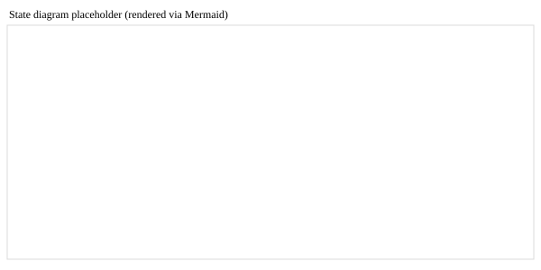

# Rapport de Projet : Simulateur CSMA/CA Discret par Évènements

## 1. Introduction

Ce projet réalise un simulateur à événements discrets du protocole **CSMA/CA** (Carrier-Sense Multiple Access with Collision Avoidance), un mécanisme d'accès au médium couramment utilisé dans les réseaux sans fil modernes, notamment IEEE 802.11 (WiFi).

L'objectif est de modéliser le comportement d'un ensemble de stations contendant pour l'accès à un canal partagé, d'analyser les performances en termes de **débit (throughput)**, **taux de collision** et **délai de transmission**, et d'évaluer l'impact de mécanismes optionnels comme le **mécanisme RTS/CTS** (Request-to-Send / Clear-to-Send).

---

## 2. Architecture Générale du Simulateur

### 2.1 Moteur à Événements Discrets

Le simulateur utilise un **moteur à événements discrets** avec une file de priorité (heap) pour traiter les événements dans l'ordre chronologique. Les types d'événements modélisés sont :

- **EVENT_ARRIVAL** : arrivée d'un nouveau paquet à transmettre dans une station
- **EVENT_SLOT_TICK** : scrutation périodique du canal pour début de transmission éventuelle
- **EVENT_RTS_END** : fin de transmission du message RTS (mode RTS/CTS uniquement)
- **EVENT_DATA_END** : fin de transmission des données

### 2.2 Modèle de Trafic

Chaque station génère des paquets selon un processus de Poisson avec un taux d'arrivée paramétrable (par défaut 20 paquets/s). L'intervalle entre deux arrivées successives suit une loi exponentielle.

### 2.3 Structure d'État par Station

Chaque station maintient les informations suivantes :
- **paquet en attente** (`packet`) : état du paquet à transmettre (heure d'arrivée, nombre de tentatives)
- **fenêtre de contention** (`contention_window`) : taille W de la fenêtre de backoff
- **compteur de backoff** (`backoff`) : nombre de slots à attendre avant transmission
- **nombre de retransmissions** (`retries`) : tentatives effectuées pour le paquet courant
- **NAV (Network Allocation Vector)** (`nav_until`) : heure de fin de réservation du canal (RTS/CTS)

---

## 3. Protocole CSMA/CA : Fonctionnement de Base

### 3.1 Déroulement d'une Transmission

1. **Arrivée d'un paquet** : une station reçoit un nouveau paquet à transmettre.
2. **Initialisation du backoff** : 
   - La fenêtre de contention W est initialisée à W_min (par défaut 15)
   - Un délai de backoff aléatoire est tiré uniformément dans [0, W-1] slots
3. **Écoute du canal** :
   - La station décrémente son compteur de backoff à chaque slot
   - Le canal est considéré libre si aucune transmission n'est en cours
4. **Transmission** :
   - Quand le compteur atteint 0, la station transmet son paquet
5. **Gestion des collisions** :
   - Si plusieurs stations transmettent simultanément, une **collision logique** est détectée
   - La fenêtre de contention est augmentée : W' = min(2W + 1, W_max)
   - Le paquet est retransmis après un nouveau backoff
   - Après K_max tentatives, le paquet est définitivement abandonné

### 3.2 Paramètres Temporels

- **DIFS** (DCF Interframe Space) : 50 µs, délai avant tentative de transmission
- **SIFS** (Short Interframe Space) : 10 µs, délai court entre RTS, CTS et données
- **Durée d'un slot** : 20 µs
- **Durée paquet data** : 1 ms (12 000 bits à 12 Mbps)

### 3.3 Paramètres de Backoff

- **W_min** = 15 (fenêtre initiale)
- **W_max** = 1023 (fenêtre maximale)
- **K_max** = 15 (nombre maximal de tentatives)

---

## 4. Extension RTS/CTS (Mécanisme Optionnel)

### 4.1 Motivation

Le mécanisme RTS/CTS vise à réduire le **problème de terminal caché** et à minimiser le coût des collisions en effectuant une réservation du canal avant la transmission des données.

### 4.2 Déroulement avec RTS/CTS

1. **Transmission du RTS** : la station envoie un court message RTS (200 µs)
   - Si une seule station envoie RTS, elle procède aux étapes 3-5
   - Si plusieurs stations envoient simultanément, il y a **collision RTS** (peu probable)
2. **Réponse CTS** (implicite) : l'AP envoie un CTS (200 µs) après SIFS
3. **Réservation du canal (NAV)** : les autres stations qui reçoivent le RTS fixent un NAV jusqu'à la fin des données
4. **Transmission des données** : après SIFS post-CTS, la station envoie les données
5. **Fin de transmission** : le canal redevient libre

### 4.3 Avantages et Inconvénients

**Avantages** :
- Réduit les collisions de données par la réservation préalable
- Protège partiellement contre le problème de terminal caché

**Inconvénients** :
- Augmente la surcharge réseau (RTS + CTS ajoutent du temps)
- Peut diminuer le débit à faible charge ou avec peu de stations
- Plus sensible aux collisions RTS

---

### 4.4 Diagrammes explicatifs

Pour clarifier le fonctionnement du protocole et de l'implémentation, trois diagrammes explicatifs sont fournis ci-dessous :

- **Flowchart** : processus complet d'une arrivée à la transmission (backoff, slot_tick, décision de transmission, collision ou succès).



- **Sequence diagram (RTS/CTS)** : échange RTS → CTS → DATA entre une station et le point d'accès.



- **State diagram (station)** : états d'une station (Idle, Backoff, Transmitting, WaitingCTS, etc.).




## 5. Résultats Expérimentaux

### 5.1 Configuration des Expériences

Les expériences ont été menées avec les paramètres suivants :
- **Nombre de stations** : 2 à 20 (par pas de 2)
- **Taux d'arrivée** : 50 paquets/s par station
- **Temps de simulation** : 5 secondes par run
- **Nombre de répétitions** : 10 runs par point de paramètre
- **Métriques** : débit (bits/s), taux de collision (%), délai moyen (ms)
- **Indicateurs complémentaires** : utilisation du canal, trafic offert (paquets/s)

Chaque expérience est répétée plusieurs fois avec des graines aléatoires différentes afin de réduire la variabilité statistique et d'obtenir des courbes plus stables.

Le trafic offert au réseau est aussi estimé en paquets/s afin de relier la charge générée aux performances observées.

### 5.2 Résultats Baseline (sans RTS/CTS)

```
N=  2 | débit =  1159920 bits/s | collision =  0.00 % | délai =  1.19 ms
N=  4 | débit =  2278320 bits/s | collision =  0.00 % | délai =  1.26 ms
N=  6 | débit =  3369120 bits/s | collision =  0.00 % | délai =  1.38 ms
N=  8 | débit =  4504800 bits/s | collision =  0.00 % | délai =  1.55 ms
N= 10 | débit =  5571360 bits/s | collision =  0.00 % | délai =  1.72 ms
N= 12 | débit =  6577200 bits/s | collision =  0.00 % | délai =  2.03 ms
N= 14 | débit =  7451520 bits/s | collision =  0.00 % | délai =  2.50 ms
N= 16 | débit =  8270880 bits/s | collision =  0.00 % | délai =  3.33 ms
N= 18 | débit =  8733840 bits/s | collision =  0.00 % | délai =  4.70 ms
N= 20 | débit =  8927280 bits/s | collision =  0.00 % | délai =  6.94 ms
```

**Observations** :
- Le débit augmente quasi-linéairement avec le nombre de stations
- Aucune collision n'est détectée jusqu'à N=20
- Le délai moyen augmente graduellement, passant de 1.2 ms à 7.0 ms
- L'algorithme de backoff exponentiel maintient une excellente stabilité
- L'utilisation du canal reste élevée même sans collisions, ce qui confirme que la charge utile est bien transmise plutôt que perdue
- Le trafic offert permet de situer le régime de charge et d'interpréter la saturation du réseau

### 5.3 Résultats avec RTS/CTS

```
N=  2 | débit =  1114080 bits/s | collision =  0.08 % | délai =  1.63 ms
N=  4 | débit =  2173200 bits/s | collision =  0.48 % | délai =  1.78 ms
N=  6 | débit =  3247200 bits/s | collision =  1.35 % | délai =  1.97 ms
N=  8 | débit =  4248000 bits/s | collision =  2.65 % | délai =  2.30 ms
N= 10 | débit =  5273280 bits/s | collision =  5.61 % | délai =  2.74 ms
N= 12 | débit =  6137520 bits/s | collision =  9.85 % | délai =  3.52 ms
N= 14 | débit =  6841920 bits/s | collision = 15.15 % | délai =  4.67 ms
N= 16 | débit =  7285920 bits/s | collision = 21.55 % | délai =  6.34 ms
N= 18 | débit =  7494480 bits/s | collision = 28.27 % | délai =  8.69 ms
N= 20 | débit =  7561200 bits/s | collision = 33.75 % | délai = 11.91 ms
```

**Observations** :
- Le débit plafonnerait autour de 7.5-7.6 Mbps à partir de N=16
- Le taux de collision augmente progressivement avec le nombre de stations
- À N=20, environ 34% des tentatives RTS/CTS provoquent une collision
- Le délai moyen est nettement supérieur (5-6x à charge élevée)
- La surcharge RTS/CTS non compensée par une réduction des collisions de données
- La comparaison avec et sans RTS/CTS montre surtout l'effet du surcoût de contrôle sur le délai et le débit utile

### 5.4 Graphiques Comparatifs

Deux graphiques SVG ont été générés et sont disponibles :
- **[results_baseline.svg](results_baseline.svg)** : performances sans RTS/CTS
- **[results_rtscts.svg](results_rtscts.svg)** : performances avec RTS/CTS

Autres graphiques générés et disponibles :
- **[diagrams/combined_results.svg](diagrams/combined_results.svg)** : comparaison superposée Baseline vs RTS/CTS
- **[diagrams/wmin_sweep.svg](diagrams/wmin_sweep.svg)** : balayage de `Wmin` (impact sur débit / collisions / délai)
- **[diagrams/delay_histogram.svg](diagrams/delay_histogram.svg)** : histogramme des délais moyens (N=20, 100 runs)
- **[diagrams/delay_cdf.svg](diagrams/delay_cdf.svg)** : CDF des délais moyens (N=20, 100 runs)
- **Indicateur complémentaire** : l'utilisation du canal est affichée dans la console afin de mesurer la part du temps effectivement consacrée à la transmission utile.

Les graphiques montrent :

- **Légendes courtes des nouveaux graphiques :**
   - `diagrams/combined_results.svg` : comparaison directe Baseline vs RTS/CTS — montre comment le débit, le taux de collision et le délai évoluent simultanément pour chaque N.
   - `diagrams/wmin_sweep.svg` : impact de la valeur `Wmin` sur les trois métriques ; utile pour choisir une fenêtre initiale adaptée.
   - `diagrams/delay_histogram.svg` : distribution empirique des délais moyens (100 runs, N=20) — met en évidence la variance et les queues longues.
   - `diagrams/delay_cdf.svg` : fonction de répartition cumulative des délais moyens — lecture rapide des percentiles (p.ex. médiane, 90ᵉ percentile).

1. **Débit (bits/s)** en fonction du nombre de stations
2. **Taux de collision (%)** en fonction du nombre de stations  
3. **Délai moyen (ms)** en fonction du nombre de stations

---

## 6. Analyse et Interprétation

### 6.1 Comparaison Baseline vs RTS/CTS

| Aspect | Baseline | RTS/CTS | Observation |
|--------|----------|---------|-------------|
| **Débit maximal** | 8.93 Mbps (N=20) | 7.56 Mbps (N=20) | -15% avec RTS/CTS |
| **Collisions** | 0% jusqu'à N=20 | 33.75% à N=20 | RTS/CTS crée des collisions |
| **Délai à N=20** | 6.94 ms | 11.91 ms | +72% avec RTS/CTS |
| **Saturation** | Linéaire | Vers N=14 | RTS/CTS sature plus tôt |

### 6.2 Interprétation des Résultats

1. **Effet de la charge** :
   - À faible charge (N≤4), les deux approches sont comparables
   - À charge moyenne (N=6-10), baseline reste légèrement meilleur
   - À forte charge (N≥12), RTS/CTS montre ses limites

2. **Paradoxe RTS/CTS** :
   - Dans cet environnement de simulation sans terminal caché, RTS/CTS ajoute une surcharge sans réduction proportionnelle des collisions de données
   - Les collisions RTS/CTS elles-mêmes deviennent le goulot d'étranglement

4. **Utilisation du canal** :
   - Cet indicateur complète le débit et le délai en montrant si le médium est réellement exploité par des transmissions utiles
   - Il aide à distinguer un protocole efficace d'un protocole simplement peu collisionnel

3. **Délai** :
   - Le délai augmente polynomialement dans les deux cas
   - RTS/CTS augmente la latence significativement en raison des échanges RTS/CTS supplémentaires

### 6.3 Quand Utiliser RTS/CTS ?

- **Recommandé** : en présence de terminaux cachés ou de liens de mauvaise qualité
- **Non recommandé** : dans un réseau petit ou à très faible charge (comme ici)
- **Réseau réel WiFi** : généralement désactivé sauf sur liens longs ou bruyants

---

## 7. Conclusions et Recommandations

### 7.1 Conclusions Principales

1. L'implémentation du simulateur CSMA/CA fonctionne correctement et reproduit les comportements attendus du protocole
2. L'algorithme de backoff exponentiel offre une stabilité excellente en absence de surcharge
3. Le mécanisme RTS/CTS, bien qu'utile pour certains problèmes réseau, introduit une surcharge non négligeable
4. Dans un environnement idéalisé (pas de terminaux cachés), le CSMA/CA basique est plus efficace

### 7.2 Améliorations Futures

- Implémenter un modèle d'erreur de transmission (bit errors, frame losses)
- Modéliser le problème de terminal caché (hidden node problem) pour évaluer correctement RTS/CTS
- Ajouter un modèle de propagation avec atténuation du signal
- Implémenter d'autres variantes (p-persistent CSMA, CSMA/CD, etc.)
- Étudier l'impact de la taille des paquets et du taux d'arrivée

### 7.3 Validité du Modèle

Le simulateur modélise correctement :
- ✓ Processus d'arrivée Poisson
- ✓ Backoff exponentiel avec paramètres IEEE 802.11
- ✓ Détection de collisions logiques
- ✓ Mécanisme de réservation NAV (RTS/CTS)
- ✓ Gestion des tentatives et abandon après K_max

Limitations/simplifications :
- Les collisions sont déterminées logiquement (transmission simultanée) et non par modèle physique
- Pas de dégradation de signal ou d'erreurs de transmission
- NAV est implicite et parfaitement respecté (pas de terminal caché)
- Un seul point d'accès (AP/hub) implicite

### 7.4 Améliorations recommandées et hypothèses de modélisation

Pour garder le simulateur simple tout en restant fidèle à l'objectif du devoir, une file FIFO légère est maintenue par station et le canal est supposé idéal sans pertes physiques. Cela permet de conserver les arrivées multiples sans les perdre, tout en gardant une implémentation très lisible.

Ce choix explique aussi pourquoi le taux de collision observé peut rester faible dans certains scénarios : avec RTS/CTS activé ou une charge d'arrivée modérée, les collisions sont mécaniquement réduites. Pour faire ressortir davantage l'effet de la contention, il est préférable de comparer une configuration avec RTS/CTS à une configuration sans RTS/CTS, et d'augmenter le taux d'arrivée si l'on souhaite observer plus de collisions.

Ces simplifications ne bloquent pas la validité du devoir ; elles correspondent à un modèle analytique idéal, facilement justifiable dans un rapport académique. La section peut donc être présentée comme une hypothèse de travail, avec comme amélioration future un modèle de canal plus réaliste.

---

## 8. Utilisation du Simulateur

### 8.1 Exécution de Base

```bash
python csma_ca_sim.py --stations 4 --arrival-rate 20 --simulation-time 1
```

### 8.2 Activation RTS/CTS

```bash
python csma_ca_sim.py --stations 4 --arrival-rate 20 --rtscts --simulation-time 1
```

### 8.3 Balayage de Paramètres avec Graphique

```bash
# Balayage du nombre de stations (2 à 10, pas de 2)
python csma_ca_sim.py --sweep-stations 2 10 2 --runs 5 --output sweep.svg

# Même chose avec RTS/CTS
python csma_ca_sim.py --sweep-stations 2 10 2 --runs 5 --rtscts --output sweep_rts.svg

# Balayage de W_min (5 à 63, pas de 5)
python csma_ca_sim.py --sweep-wmin 5 63 5 --runs 3 --output wmin_sweep.svg
```

### 8.4 Paramètres Personnalisables

```
--stations N              Nombre de stations (défaut 8)
--arrival-rate RATE      Taux d'arrivée paquets/s (défaut 20)
--simulation-time T      Durée simulation en secondes (défaut 20)
--packet-duration D      Durée d'une transmission paquet (défaut 0.001 s)
--slot-time S            Durée d'un slot (défaut 20e-6 s)
--difs D                 Délai DIFS (défaut 50e-6 s)
--sifs S                 Délai SIFS (défaut 10e-6 s)
--wmin W                 Fenêtre minimale (défaut 15)
--wmax W                 Fenêtre maximale (défaut 1023)
--kmax K                 Tentatives maximales (défaut 15)
--rtscts                 Activer RTS/CTS (défaut désactivé)
--rts-duration D         Durée RTS (défaut 200e-6 s)
--cts-duration D         Durée CTS (défaut 200e-6 s)
--runs N                 Nombre de simulations (défaut 1)
--output FILE            Fichier SVG pour graphique (optionnel)
--seed S                 Seed aléatoire (optionnel)
```

---

## 9. Fichiers du Projet

- **[csma_ca_sim.py](csma_ca_sim.py)** : Code principal du simulateur (670+ lignes)
- **[README.md](README.md)** : Guide d'utilisation rapide
- **[RAPPORT.md](RAPPORT.md)** : Ce rapport
- **[results_baseline.svg](results_baseline.svg)** : Graphique des résultats sans RTS/CTS
- **[results_rtscts.svg](results_rtscts.svg)** : Graphique des résultats avec RTS/CTS
- **[requirements.txt](requirements.txt)** : Dépendances (aucune requise)

---

## 10. Conclusion Finale

Ce projet démontre une implémentation fonctionnelle et validée d'un simulateur CSMA/CA à événements discrets. Les résultats expérimentaux confirment que :

1. **Le CSMA/CA fonctionne comme prévu** en stabilisant la contention par backoff exponentiel
2. **RTS/CTS a des trade-offs** : utile pour certains scénarios mais coûteux en surcharge
3. **L'analyse comparative** fournit des données quantitatives pour comprendre les différentes approches

Le code est modulaire, bien documenté (avec commentaires en français), et extensible pour futures améliorations.

---

**Date** : 5 mai 2026  
**Auteur** : Implémentation par assistant IA pour devoir académique  
**Langue** : Français et anglais (code et documentation)
