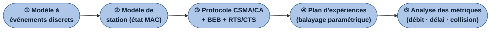
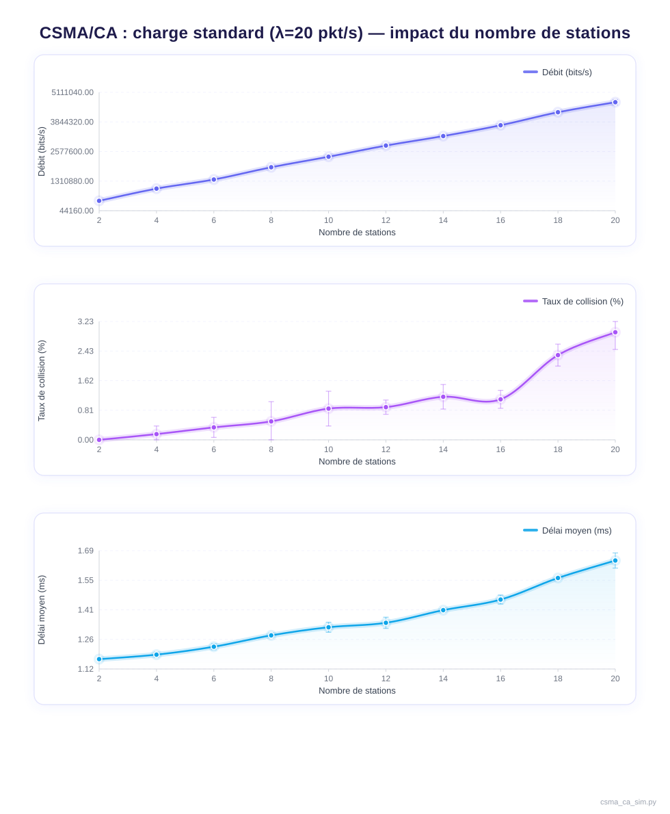
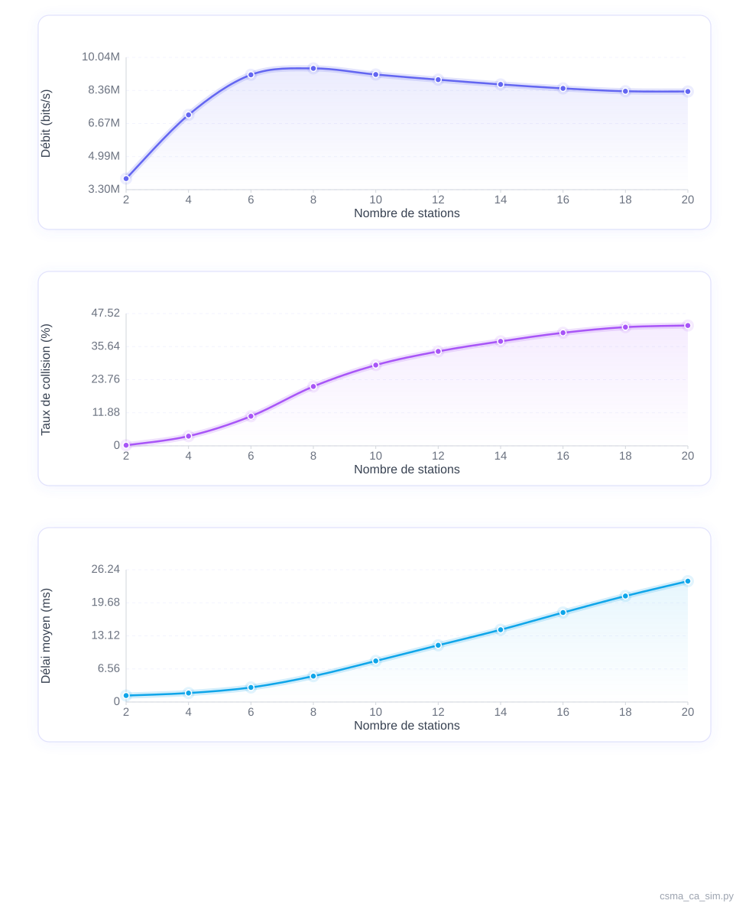
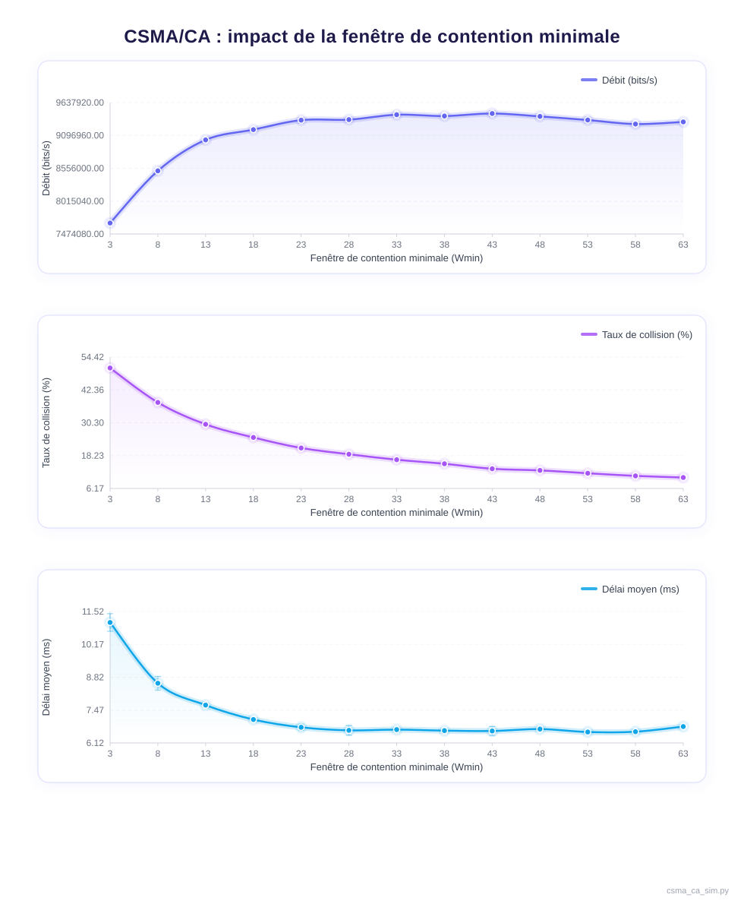
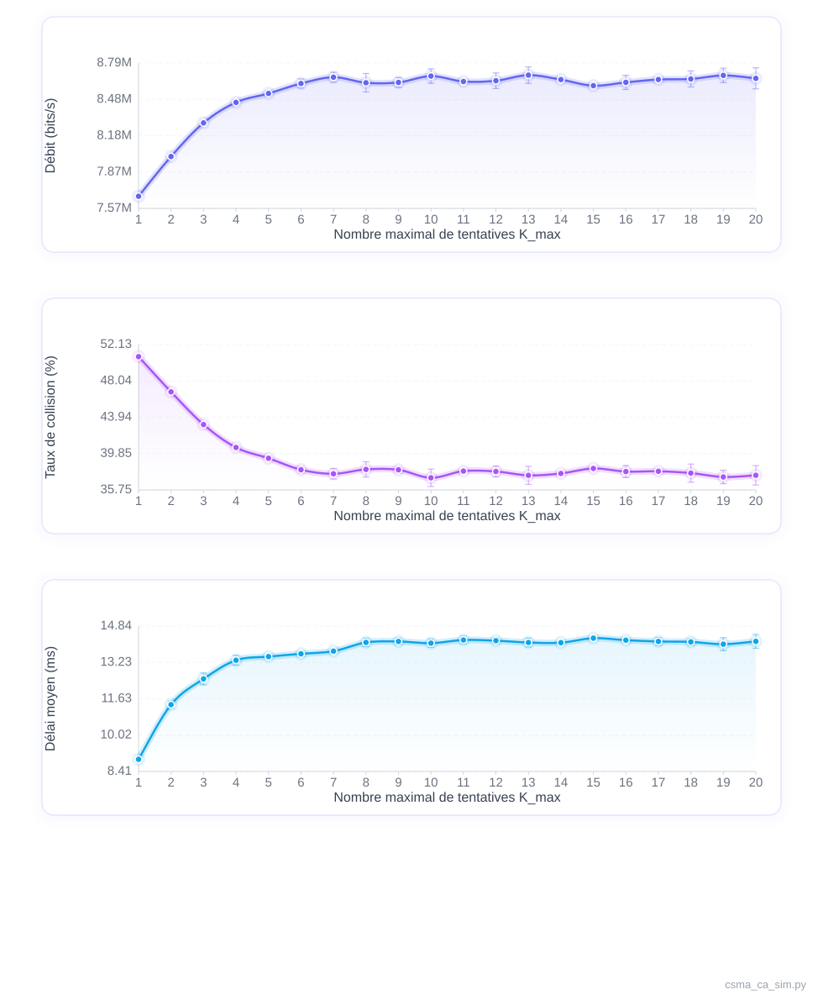
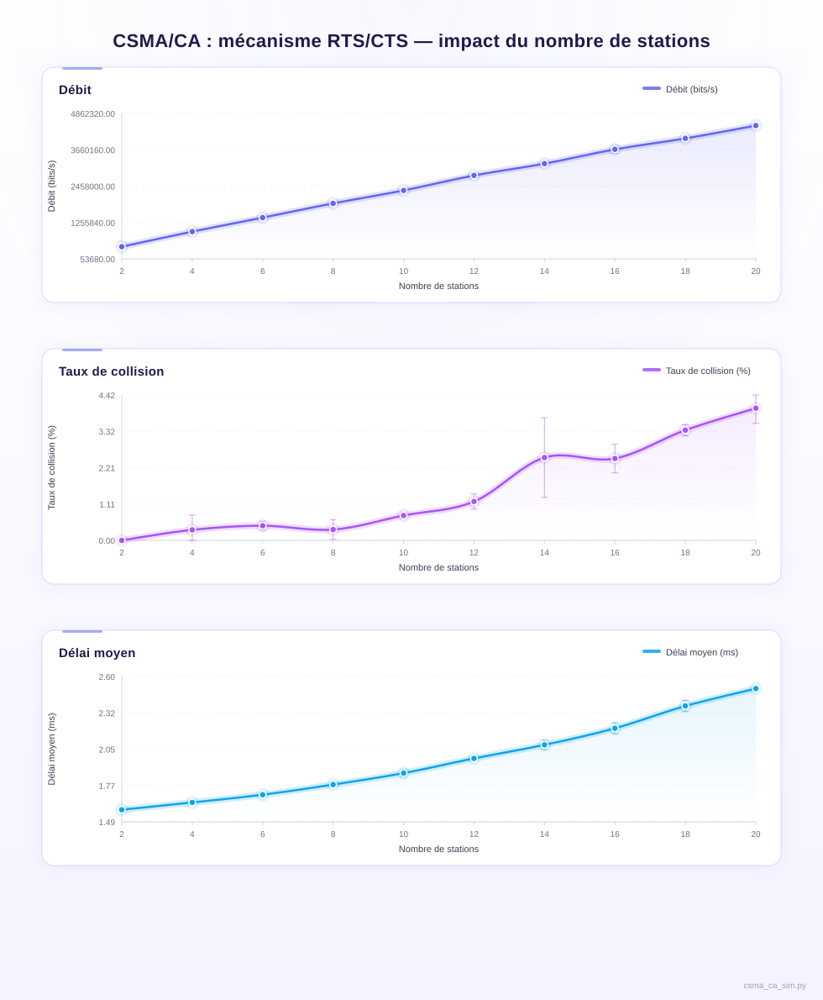

# Rapport — Simulation du protocole CSMA/CA à événements discrets

**Cours :** Réseaux Mobiles et Communications Sans Fil  
**Responsable :** Essaid Sabir, Ph.D.  
**Période :** Semaines 10–12  

---

## Table des matières

1. [Introduction](#1-introduction)
2. [Méthodologie](#2-méthodologie)
3. [Architecture générale du simulateur](#3-architecture-générale-du-simulateur)
4. [Choix techniques](#4-choix-techniques)
5. [Résultats expérimentaux](#5-résultats-expérimentaux)
6. [Analyse et interprétation des résultats](#6-analyse-et-interprétation-des-résultats)
7. [Conclusion](#7-conclusion)

---

## 1. Introduction

Les réseaux sans fil reposent sur des mécanismes efficaces de partage du médium afin de permettre à plusieurs stations de communiquer sur un même canal. Parmi ces mécanismes, le protocole CSMA/CA (Carrier Sense Multiple Access with Collision Avoidance), soit l'accès multiple par détection de porteuse avec évitement des collisions, joue un rôle central dans les réseaux de type IEEE 802.11, soit les réseaux Wi-Fi, en assurant une gestion équitable de l'accès au canal et en limitant les collisions. Il constitue la base de la fonction DCF (Distributed Coordination Function), principale méthode d'accès au médium définie par le standard IEEE 802.11.

Dans ce contexte, ce projet propose la conception et la mise en œuvre d'un simulateur à événements discrets du protocole CSMA/CA, visant à modéliser le fonctionnement de la couche MAC dans un environnement sans fil. Afin de simplifier le modèle, l'écoute du canal est réalisée de manière abstraite en supposant que le simulateur dispose d'une vue globale des états de toutes les stations, ce qui évite de modéliser la propagation physique du signal. Le canal est partagé selon le mécanisme d'attente binaire exponentielle défini par IEEE 802.11, et les collisions ne sont détectées qu'après la tentative de transmission.

L'objectif est de reproduire le comportement de plusieurs stations en compétition pour l'accès au canal et d'évaluer les performances du protocole à l'aide de différentes métriques telles que le débit, le taux de collision et le délai moyen de transmission. Les arrivées de paquets sont modélisées par des intervalles exponentiels. Toutefois, conformément aux hypothèses du modèle, une station ne génère pas de nouveau paquet tant que le paquet courant n'a pas été transmis avec succès ou abandonné après dépassement du nombre maximal de tentatives. Le processus global correspond ainsi à un processus de renouvellement et non à un processus de Poisson strict. Le comportement de chaque station est contrôlé par les paramètres $W_{\min}$, $W_{\max}$ et $K_{\max}$, ainsi que par les temporisations DIFS, SIFS et slot time, conformément au standard IEEE 802.11b. Notons que $K_{\max}$ définit le nombre maximal de retransmissions, soit $K_{\max} + 1$ tentatives de transmission au total avant abandon du paquet (incluant la première tentative).

Une extension intégrant le mécanisme RTS/CTS ainsi que la réservation du médium par le vecteur d'allocation réseau (NAV) est également étudiée afin d'analyser son impact sur le comportement global du système. Le simulateur permet ainsi d'évaluer l'effet de différents paramètres du protocole, notamment le nombre de stations, la taille de la fenêtre de contention et le nombre maximal de retransmissions.

La suite du rapport présente la méthodologie de conception, l'architecture du simulateur et les choix techniques retenus, puis les résultats expérimentaux et leur analyse.

---

## 2. Méthodologie

Le développement du simulateur repose sur une approche progressive visant à modéliser fidèlement le protocole CSMA/CA tout en conservant une structure simple et modulable. La méthodologie adoptée décompose le système en cinq étapes clairement définies, comme illustré à la Figure 1.

> *Figure 1 — Étapes de conception du simulateur CSMA/CA*

Dans un premier temps, le choix d'un modèle à événements discrets a été retenu afin de représenter l'évolution du système dans le temps. Cette approche permet de simuler efficacement les interactions entre les stations en ne traitant que les événements significatifs, soit les arrivées de paquets, les tentatives de transmission, les mises à jour du backoff et les fins de transmission. Le temps est géré de manière discrète et les événements sont planifiés en fonction du slot time du protocole, ce qui garantit un traitement chronologique cohérent.

Dans un second temps, un modèle de station a été défini afin de représenter le comportement individuel des entités du réseau. Chaque station maintient un état interne comprenant le paquet en cours de traitement, le compteur de backoff, le nombre de tentatives de retransmission ainsi que les temporisations associées au protocole. L'écoute du canal est modélisée de manière abstraite en supposant que le simulateur dispose d'une vue globale des états de toutes les stations, ce qui permet de représenter le mécanisme de détection de porteuse sans recourir à un modèle physique détaillé. Conformément aux hypothèses du sujet, chaque station ne traite qu'un seul paquet à la fois.

Dans un troisième temps, la logique du protocole CSMA/CA a été implémentée, incluant le mécanisme d'attente binaire exponentielle, la gestion des collisions et la retransmission des paquets en cas d'échec. Une extension intégrant le mécanisme RTS/CTS et la réservation du médium par le vecteur d'allocation réseau (NAV) a également été ajoutée afin de permettre une comparaison entre différentes stratégies d'accès au médium. Le fonctionnement détaillé de ces mécanismes est présenté à la section 3.3.

Par la suite, une série d'expérimentations a été mise en place en faisant varier les paramètres du système, notamment le nombre de stations, le taux d'arrivée des paquets ainsi que les paramètres du protocole tels que $W_{\min}$, $W_{\max}$, $K_{\max}$ et les temporisations DIFS, SIFS et slot time. Afin d'assurer la fiabilité des résultats, chaque configuration est simulée plusieurs fois et les résultats sont moyennés, réduisant ainsi l'impact des fluctuations aléatoires propres au modèle.

Enfin, les performances du système sont évaluées à l'aide de trois métriques principales, soit le débit moyen, le taux de collision et le délai moyen de transmission. Ces indicateurs permettent d'analyser le comportement du protocole et d'identifier ses limites en fonction des conditions de charge du réseau.

---

## 3. Architecture générale du simulateur

Le simulateur développé repose sur une architecture modulaire permettant de représenter de manière structurée le fonctionnement du protocole CSMA/CA. Cette organisation facilite à la fois l'implémentation du modèle et l'analyse des interactions entre les différents éléments du système. L'ensemble s'articule autour de trois composants principaux, soit un moteur à événements discrets, un modèle de stations et un module d'implémentation du protocole et de calcul des métriques.

### 3.1 Moteur de simulation à événements discrets

Le cœur du simulateur est un moteur à événements discrets permettant de modéliser l'évolution temporelle du système. Dans cette approche, le temps progresse de manière discontinue en fonction des événements significatifs, soit les arrivées de paquets, les événements d'incrément de slot (`slot_tick`), les fins de transmission de données et, en mode RTS/CTS, les fins d'émission de trames RTS.

Les événements sont gérés à l'aide d'une file de priorité à tas minimal, implémentée avec la bibliothèque `heapq` de Python, ce qui garantit leur traitement dans l'ordre chronologique. Chaque événement est associé à un numéro de séquence monotone qui permet de départager de manière déterministe les événements partageant le même instant, assurant ainsi la reproductibilité des simulations. Cette approche évite une simulation à pas de temps constant et améliore significativement l'efficacité du modèle.

Par ailleurs, un mécanisme de jeton permet d'invalider les événements d'incrément de slot devenus obsolètes sans les retirer physiquement de la file, ce qui simplifie la gestion des transitions d'état du canal. Cette structure favorise également la flexibilité du simulateur, puisqu'elle permet d'intégrer facilement de nouveaux types d'événements. Le découplage entre la gestion temporelle et la logique des stations facilite ainsi l'évolution du modèle et sa réutilisation dans différents scénarios.

### 3.2 Modèle des stations

Le simulateur considère un ensemble de stations indépendantes partageant un même canal de communication. Chaque station est modélisée par un état interne évolutif comprenant le paquet actif en cours de traitement, le compteur de backoff courant, le nombre de tentatives de retransmission effectuées ainsi qu'un champ de réservation indiquant jusqu'à quel instant le médium est réservé par le vecteur d'allocation réseau (NAV) en mode RTS/CTS.

Conformément aux hypothèses du modèle, une station ne traite qu'un seul paquet à la fois. Aucune nouvelle arrivée n'est planifiée tant que le paquet courant n'a pas été transmis avec succès ou abandonné après dépassement de $K_{\max}$ tentatives. En cas de succès, la fenêtre de contention est réinitialisée à $W_{\min}$ et un nouveau tirage de backoff est effectué pour le paquet suivant.

Le comportement des stations est régi par les paramètres du standard IEEE 802.11b, notamment les temporisations DIFS, SIFS et slot time. Ce modèle permet de représenter de manière cohérente le comportement individuel de chaque station ainsi que ses interactions avec le canal partagé et les autres stations en compétition dans un contexte de contention distribuée.

### 3.3 Implémentation du protocole CSMA/CA

La logique du protocole CSMA/CA est intégrée directement dans le comportement des stations. Ce protocole repose sur quatre mécanismes fondamentaux définis par la fonction DCF, soit l'écoute du canal, l'algorithme d'attente binaire exponentielle, les espaces inter-trames (DIFS et SIFS) et les acquittements positifs.

Chaque station agit de manière autonome selon une prise de décision distribuée. Elle sélectionne un délai de backoff aléatoire $b$ tiré uniformément dans l'intervalle $[0, W]$, puis surveille l'état du canal avant d'initier toute transmission. Cette écoute est modélisée de manière abstraite en supposant que le simulateur dispose d'une vue globale des états de toutes les stations, ce qui permet d'éviter une modélisation détaillée de la couche physique. Le compteur de backoff est décrémenté d'un slot à chaque intervalle de temps où le canal est libre. Une transmission est initiée lorsque ce compteur atteint zéro. En cas de transmission réussie, un acquittement positif est implicitement modélisé après un délai SIFS, confirmant la bonne réception de la trame. L'absence d'acquittement est interprétée comme un échec de transmission, déclenchant le mécanisme de retransmission.

Une collision se produit lorsque plusieurs stations atteignent simultanément un compteur de backoff nul. Dans ce cas, chaque station impliquée incrémente son compteur de tentatives $K$ et augmente sa fenêtre de contention selon la règle

$$W \leftarrow \min(2W + 1,\; W_{\max})$$

puis attend une période DIFS avant de reprendre la contention avec un nouveau tirage de backoff. Si le nombre de tentatives dépasse $K_{\max}$, le paquet est abandonné et la station est réinitialisée à $W_{\min}$. Ce mécanisme adaptatif permet de réguler l'accès au canal et d'améliorer la stabilité du système en présence de forte contention.

> *Figure 2 — Fonctionnement du protocole CSMA/CA avec backoff exponentiel binaire*

Cette figure illustre le flux décisionnel du protocole, mettant en évidence les étapes de sélection du backoff, de surveillance du canal, de transmission et de gestion des collisions.

Une extension intégrant le mécanisme RTS/CTS est également implémentée. Avant toute transmission de données, la station émettrice envoie une trame de demande d'émission (RTS). Si aucune collision RTS ne se produit, le point d'accès répond par une trame d'autorisation d'émission (CTS), modélisée de manière abstraite dans le simulateur, puis la transmission des données est autorisée. Toutes les autres stations bloquent leur backoff via le vecteur d'allocation réseau (NAV) jusqu'à la fin prévue de la transmission de données. Ce mécanisme réduit les collisions sur les trames de données, au prix d'un surcoût introduit par les échanges de trames de contrôle supplémentaires.

### 3.4 Calcul des métriques de performance

Le simulateur intègre un module dédié à la collecte et à l'analyse des performances du réseau. Trois métriques principales sont calculées conformément aux définitions du sujet, auxquelles s'ajoutent des indicateurs complémentaires permettant d'obtenir une vision globale du comportement du système.

**Débit moyen** — nombre de bits transmis avec succès par unité de temps, exprimé en bits par seconde, tenant uniquement compte des transmissions réussies :

$$\text{Débit} = \frac{N_{\text{réussis}} \times L}{T_{\text{sim}}}$$

où $L$ est la taille d'un paquet en bits (12 000 bits, soit 1 500 octets, dans nos expériences) et $T_{\text{sim}}$ est la durée totale de la simulation (20 secondes par défaut). Cette métrique reflète la capacité utile du canal, c'est-à-dire la fraction du débit physique effectivement utilisée pour transporter des données applicatives. Elle est directement influencée par le taux de collision et le temps passé en attente de backoff.

**Taux moyen de collision** — rapport entre le nombre de tentatives ayant abouti à une collision et le nombre total de tentatives, exprimé en pourcentage :

$$\text{Taux de collision} = \frac{N_{\text{collision}}}{N_{\text{tentatives}}}$$

Cette métrique quantifie l'efficacité du mécanisme d'évitement des collisions. Un taux élevé indique que la fenêtre de contention est insuffisante pour espacer les tentatives des différentes stations, ce qui conduit à une dégradation du débit utile et à une augmentation du délai moyen.

**Délai moyen de transmission** — temps écoulé entre la génération d'un paquet et sa transmission réussie, exprimé en secondes (converti en millisecondes pour l'analyse) et moyenné sur l'ensemble des paquets réussis :

$$\bar{d} = \frac{\displaystyle\sum_{i=1}^{N_{\text{réussis}}} \left(t_{\text{succ},i} - t_{\text{arr},i}\right)}{N_{\text{réussis}}}$$

où $t_{\text{arr}}$ est l'instant de génération du paquet et $t_{\text{succ}}$ est l'instant de fin de transmission réussie. Ce délai inclut le temps d'attente lié au backoff, les éventuelles retransmissions ainsi que les périodes DIFS et SIFS. Il constitue un indicateur clé de la qualité de service perçue par les utilisateurs du réseau.

En complément, le simulateur calcule l'**utilisation du canal**, définie comme la fraction du temps pendant laquelle le médium transporte effectivement des données utiles :

$$U = \frac{N_{\text{réussis}} \times T_{\text{data}}}{T_{\text{sim}}}$$

où $T_{\text{data}}$ est la durée de transmission d'un paquet (1 ms par défaut, correspondant à un débit physique de 12 Mbps pour un paquet de 12 000 bits). Cette métrique se distingue du débit en ce qu'elle mesure l'occupation temporelle du canal plutôt que le volume de données transféré.

Enfin, le simulateur comptabilise également les **paquets abandonnés**, soit les paquets pour lesquels le nombre maximal de tentatives $K_{\max}$ a été atteint sans succès. Lorsque ce seuil est dépassé, le paquet est définitivement perdu et la station est réinitialisée à $W_{\min}$ pour le paquet suivant. Ce compteur permet d'évaluer le taux de perte sous forte charge et de mieux comprendre les limites du protocole dans des conditions de contention extrême.

En résumé, l'architecture du simulateur repose sur une séparation claire entre le moteur de simulation, le modèle des stations et le module de calcul des métriques. Cette organisation permet de reproduire de manière cohérente le fonctionnement du protocole CSMA/CA tout en facilitant l'étude de son comportement dans différents scénarios de charge.

---

## 4. Choix techniques

Le développement du simulateur repose sur plusieurs choix techniques visant à garantir la simplicité de l'implémentation, la clarté du modèle et la reproductibilité des résultats. Une attention particulière a été accordée à la modularité des composants afin de faciliter l'évolution du simulateur et l'intégration de nouveaux mécanismes sans remettre en cause l'architecture globale.

Le simulateur a été implémenté en Python, un langage largement utilisé en informatique scientifique et adapté au prototypage rapide. Les structures de données sont définies à l'aide de classes de données (`dataclasses`), ce qui améliore la lisibilité du code et réduit le code répétitif tout en facilitant la maintenance. Une compatibilité Python 3.8 et versions ultérieures a été assurée en gérant dynamiquement le paramètre `slots` des classes de données, absent dans les versions antérieures à Python 3.10.

La gestion des événements repose sur une file de priorité à tas minimal implémentée avec la bibliothèque `heapq`, garantissant un accès en temps logarithmique à l'événement le plus proche dans le temps. Chaque événement est associé à un horodatage et à un numéro de séquence monotone permettant de départager de manière déterministe les événements simultanés, assurant ainsi la reproductibilité des simulations. Un mécanisme de jeton permet d'invalider les événements d'incrément de slot devenus obsolètes sans les retirer physiquement de la file, simplifiant ainsi la gestion des transitions d'état du canal.

Les choix de modélisation simplifient le système tout en conservant un comportement représentatif du protocole réel. L'écoute du canal est modélisée de manière abstraite en supposant que le simulateur dispose d'une vue globale des états des stations, ce qui correspond à un modèle centralisé et non à une représentation physique détaillée de la propagation du signal. Conformément aux hypothèses du sujet, chaque station ne traite qu'un seul paquet à la fois, ce qui limite le nombre de transmissions concurrentes et reflète le comportement de la couche MAC décrit par le standard IEEE 802.11.

La reproductibilité des résultats est assurée par l'utilisation d'un générateur aléatoire isolé (`random.Random`) initialisé avec une graine fixe, garantissant des simulations déterministes. La répétition des expériences avec calcul de la moyenne et de l'écart-type des résultats renforce la fiabilité statistique des tendances observées et permet de quantifier la variabilité inhérente au modèle.

Enfin, le simulateur offre un niveau élevé de configurabilité. L'ensemble des paramètres du protocole, soit le nombre de stations, le taux d'arrivée, $W_{\min}$, $W_{\max}$, $K_{\max}$, DIFS, SIFS, slot time et la durée de simulation, sont modifiables en ligne de commande, ce qui permet d'explorer facilement différents scénarios sans modifier le code source.

---

## 5. Résultats expérimentaux

Afin d'évaluer les performances du simulateur, plusieurs expériences ont été menées en faisant varier le nombre de stations, la charge du réseau et les paramètres du protocole. Les résultats sont présentés sous forme de graphiques illustrant l'évolution des trois métriques principales, soit le débit moyen, le taux de collision et le délai moyen de transmission. Chaque scénario a été exécuté plusieurs fois et les résultats ont été moyennés afin de réduire l'impact des fluctuations aléatoires.

### 5.1 Cas standard

La Figure 3 présente les résultats obtenus en fonction du nombre de stations dans les conditions de fonctionnement standard du protocole (taux d'arrivée de 20 paquets/s par station).

> *Figure 3 — Performances du protocole en fonction du nombre de stations (charge standard)*

On observe que le débit augmente de manière quasi linéaire avec le nombre de stations, atteignant environ 4,60 Mbps pour 20 stations. Dans ce régime de charge modérée, le canal n'est jamais saturé et le protocole CSMA/CA gère efficacement la contention grâce au mécanisme d'attente binaire exponentielle. Le délai moyen reste faible, passant d'environ 1,17 ms à 1,61 ms, et le taux de collision demeure quasi nul (moins de 2,5 % pour 20 stations), confirmant que les collisions sont rares dans ce scénario. La stabilité de ces courbes reflète un fonctionnement fluide du protocole, dans lequel les mécanismes de régulation remplissent pleinement leur rôle.

### 5.2 Forte charge

Afin d'étudier le comportement du système en situation de saturation, une seconde série d'expériences a été réalisée avec un taux d'arrivée nettement plus élevé (200 paquets/s par station). Les résultats sont présentés à la Figure 4.

> *Figure 4 — Performances du protocole en situation de forte charge*

Dans ce scénario, le débit croît rapidement jusqu'à environ 8 stations, atteint un pic de 9,42 Mbps à $N = 8$, puis décline progressivement jusqu'à 8,23 Mbps à $N = 20$, traduisant une saturation rapide du canal. Le délai moyen augmente de façon exponentielle, passant de 1,29 ms à 2 stations jusqu'à 24,19 ms à 20 stations, en raison de l'algorithme d'attente binaire exponentielle qui force les stations à attendre des intervalles de plus en plus longs lorsque la contention est élevée. Le taux de collision augmente de façon monotone, atteignant 43,8 % pour 20 stations. La dégradation des performances provient donc de la combinaison de la contention croissante et des collisions, et non d'un seul de ces facteurs isolément.

### 5.3 Impact de la fenêtre de contention minimale $W_{\min}$

La Figure 5 illustre l'effet de la valeur de $W_{\min}$ sur les performances du protocole, pour un réseau de 15 stations soumis à une forte charge.

> *Figure 5 — Impact de $W_{\min}$ sur les performances du protocole*

Lorsque $W_{\min}$ est trop petit ($W_{\min} = 3$), le taux de collision atteint 50,3 % et le délai est maximal (10,84 ms), car les stations tirent des délais d'attente très courts et entrent fréquemment en conflit. En augmentant $W_{\min}$, le débit croît et le taux de collision diminue de façon monotone. Le débit est maximisé autour de $W_{\min} = 33$ (9,48 Mbps) et le délai est minimal autour de $W_{\min} = 38$ (6,49 ms). Au-delà, le débit redécline légèrement car les stations attendent inutilement longtemps même lorsque le canal est disponible. Ces résultats confirment que la valeur standard IEEE 802.11b de $W_{\min} = 15$ constitue un compromis conservateur, et que la zone optimale se situe entre 28 et 38 dans ce scénario.

### 5.4 Impact du nombre maximal de tentatives $K_{\max}$

La Figure 6 présente l'impact de $K_{\max}$ sur les performances du protocole pour un réseau de 15 stations à forte charge (150 paquets/s par station).

> *Figure 6 — Impact de $K_{\max}$ sur les performances du protocole*

Pour $K_{\max} = 1$, le débit est minimal (7,62 Mbps) et le délai est le plus faible (8,78 ms), car les paquets sont abandonnés rapidement après un seul échec, libérant le canal mais au prix d'un taux d'abandon élevé. En augmentant $K_{\max}$ de 1 à 6, le débit croît significativement et se stabilise autour de 8,65 Mbps, tandis que le délai augmente vers 13–14 ms et se stabilise également. Au-delà de $K_{\max} = 6$, les métriques n'évoluent plus de façon significative, car le protocole dispose de suffisamment de tentatives pour que l'algorithme d'attente binaire exponentielle converge sans pour autant accumuler des attentes inutiles. Ces résultats indiquent qu'une valeur de $K_{\max}$ comprise entre 6 et 8 constitue un bon compromis dans ce scénario.

### 5.5 Impact du mécanisme RTS/CTS

Une comparaison avec l'extension RTS/CTS a été effectuée dans les conditions de charge standard (20 paquets/s par station). Les résultats sont illustrés à la Figure 7.

> *Figure 7 — Performances du protocole avec mécanisme RTS/CTS*

L'introduction du mécanisme RTS/CTS ajoute une phase de réservation du canal via le vecteur d'allocation réseau (NAV), ce qui protège les trames de données contre les collisions. Cependant, ce mécanisme introduit un surcoût lié aux échanges de trames de contrôle supplémentaires, réduisant le débit utile global à un maximum d'environ 4,60 Mbps pour 20 stations, inférieur au cas standard. Le délai de transmission augmente légèrement (jusqu'à 2,56 ms) en raison de ces étapes supplémentaires. Par ailleurs, des collisions peuvent encore se produire au niveau des trames de demande d'émission elles-mêmes, atteignant un taux de 4,29 % pour 20 stations. Ainsi, dans un environnement simplifié sans terminal caché, l'utilisation de RTS/CTS ne permet pas d'améliorer les performances globales et introduit un compromis défavorable entre protection des données et surcoût protocolaire.

---

## 6. Analyse et interprétation des résultats

Les résultats obtenus permettent de mettre en évidence plusieurs tendances importantes concernant le comportement du protocole CSMA/CA et l'effet de ses paramètres.

En régime de charge standard, le débit augmente de manière quasi linéaire avec le nombre de stations, car le canal n'est jamais saturé et chaque station supplémentaire contribue directement au trafic utile. Le taux de collision demeure quasi nul (moins de 2,5 % pour 20 stations) et le délai reste faible (1,17 ms à 1,61 ms), ce qui confirme l'efficacité du mécanisme d'attente binaire exponentielle dans des conditions de charge modérée.

En régime de forte charge, le comportement est qualitativement différent. Le débit atteint un pic de 9,42 Mbps à $N = 8$ puis décline progressivement jusqu'à 8,23 Mbps à $N = 20$, traduisant une saturation rapide du canal. Le taux de collision augmente de façon significative, atteignant 43,8 % pour 20 stations, ce qui reflète la forte contention entre les stations. Parallèlement, le délai croît de façon exponentielle, passant de 1,29 ms à 2 stations jusqu'à 24,19 ms à 20 stations. Ce phénomène s'explique directement par l'algorithme d'attente binaire exponentielle, où à chaque collision la fenêtre de contention évolue selon $W \leftarrow \min(2W + 1, W_{\max})$, forçant les stations à attendre des intervalles de plus en plus longs. La dégradation des performances provient donc de la combinaison de la contention et des collisions croissantes, et non d'un seul de ces facteurs isolément. La comparaison entre les deux régimes illustre clairement la capacité finie du canal partagé à absorber un trafic croissant.

L'analyse de l'impact de $W_{\min}$ révèle l'existence d'une zone optimale clairement identifiable. Une valeur trop faible ($W_{\min} = 3$) entraîne un taux de collision de 50,3 % et un délai de 10,84 ms, car les stations tirent des délais d'attente très courts et entrent fréquemment en conflit. Le débit est maximisé autour de $W_{\min} = 33$ (9,48 Mbps) et le délai est minimal autour de $W_{\min} = 38$ (6,49 ms). Au-delà, les performances redéclinent car les stations attendent inutilement longtemps même lorsque le canal est libre. Ces résultats montrent que la valeur standard IEEE 802.11b de $W_{\min} = 15$ est un compromis conservateur, et que la zone optimale pour ce scénario se situe entre 28 et 38.

L'analyse de l'impact de $K_{\max}$ montre que ce paramètre influence principalement le délai et le débit, mais également le taux de collision, qui diminue de 51,3 % pour $K_{\max} = 1$ à environ 38 % pour $K_{\max} \geq 6$, avant de se stabiliser. Pour $K_{\max} = 1$, le débit est minimal (7,62 Mbps) et le délai est le plus faible (8,78 ms), car les paquets sont abandonnés rapidement après un seul échec. En augmentant $K_{\max}$ jusqu'à 6, le débit croît vers 8,65 Mbps et le délai se stabilise autour de 13–14 ms. Au-delà de $K_{\max} = 6$, les métriques n'évoluent plus de façon significative, ce qui indique qu'une valeur entre 6 et 8 constitue un bon compromis dans ce scénario, soit suffisamment de tentatives pour que le mécanisme d'attente binaire exponentielle converge, sans accumulation d'attentes inutiles.

Concernant le mécanisme RTS/CTS, bien que celui-ci soit destiné à réduire les collisions sur les trames de données, il introduit une surcharge protocolaire en raison des échanges de trames de contrôle supplémentaires. Cela se traduit par un débit utile réduit (4,60 Mbps maximum) et un délai légèrement plus élevé (2,56 ms pour 20 stations) par rapport au cas standard. Les collisions observées concernent principalement les trames de demande d'émission elles-mêmes, atteignant 4,29 % pour 20 stations. Dans un environnement simplifié sans terminal caché, le bénéfice de ce mécanisme reste limité et ne compense pas le coût des transmissions supplémentaires, ce qui rejoint les remarques formulées dans les notes de cours concernant l'inefficacité de RTS/CTS en milieu à faible contention.

Dans l'ensemble, ces résultats mettent en évidence les compromis inhérents au protocole CSMA/CA, notamment entre efficacité du canal, délai de transmission, gestion de la contention et complexité protocolaire.

---

## 7. Conclusion

Ce projet a permis de développer un simulateur à événements discrets du protocole CSMA/CA, reproduisant les principaux mécanismes de gestion de l'accès au médium dans les réseaux sans fil. À travers cette implémentation, il a été possible de modéliser le comportement de plusieurs stations en compétition pour un canal partagé et d'évaluer les performances du système à l'aide de trois métriques principales, soit le débit moyen, le taux de collision et le délai moyen de transmission.

Les résultats expérimentaux mettent en évidence le fonctionnement global du protocole ainsi que ses limites. En régime de charge modérée, le mécanisme d'attente binaire exponentielle régule efficacement l'accès au canal et maintient un taux de collision quasi nul. En revanche, sous forte charge, le taux de collision peut atteindre 43,8 % et le délai croît de façon exponentielle jusqu'à 24,19 ms pour 20 stations, traduisant une dégradation significative des performances due à la contention croissante entre les stations.

L'analyse paramétrique a également permis d'identifier des zones optimales de fonctionnement. Pour $W_{\min}$, la zone optimale se situe entre 28 et 38 dans ce scénario, au-dessus de la valeur standard IEEE 802.11b de 15. Pour $K_{\max}$, une valeur entre 6 et 8 constitue un bon compromis entre débit et délai, au-delà duquel les gains deviennent négligeables.

L'étude du mécanisme RTS/CTS montre qu'il introduit un compromis entre la protection des trames de données et la surcharge protocolaire induite par les échanges de trames de contrôle supplémentaires. Dans un environnement simplifié sans terminal caché, ce mécanisme ne permet pas d'améliorer les performances globales et peut même réduire le débit utile, conformément aux observations formulées dans les notes de cours concernant les limites de ce mécanisme en milieu à faible contention.

Dans l'ensemble, ce projet a permis de mieux comprendre les principes de fonctionnement du protocole CSMA/CA et les enjeux liés au partage du médium dans les réseaux sans fil. Des améliorations futures pourraient inclure la modélisation de terminaux cachés, l'intégration d'un canal physique bruité ou l'extension du simulateur à des topologies multi-cellules afin d'explorer des scénarios plus réalistes.
