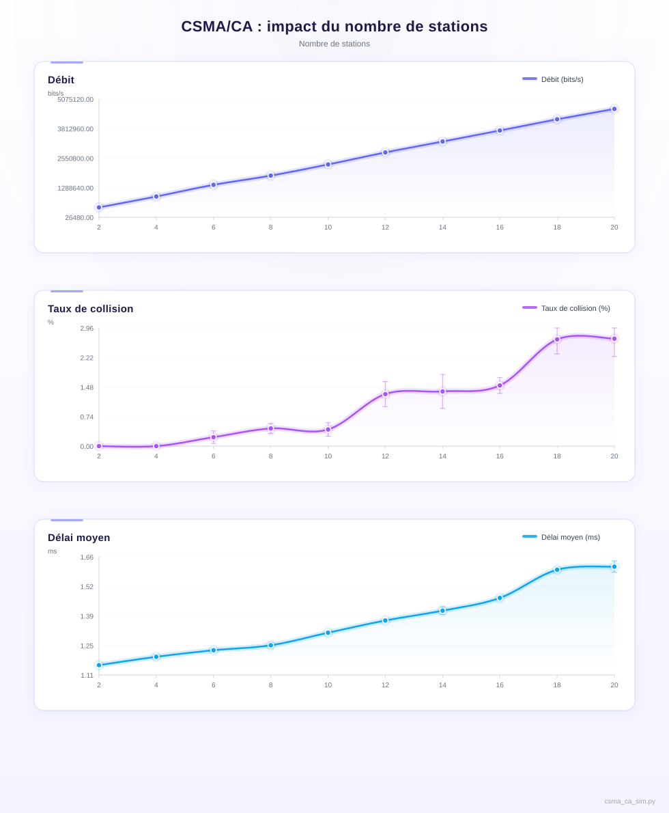
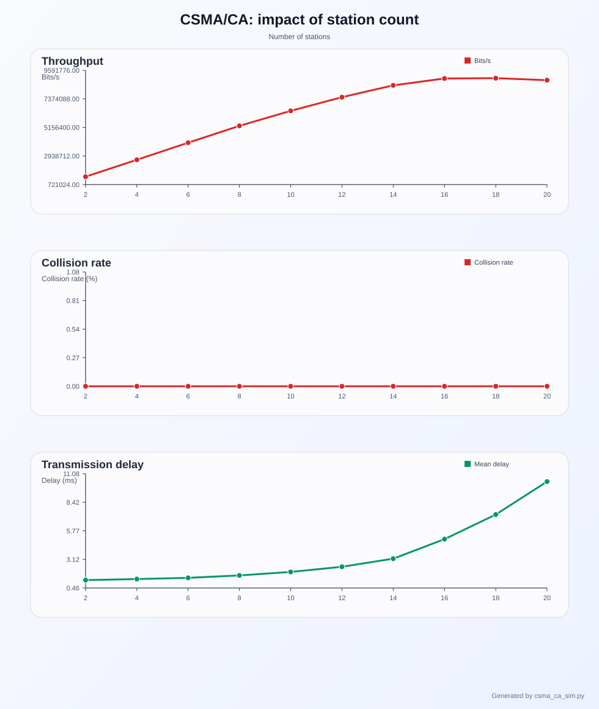
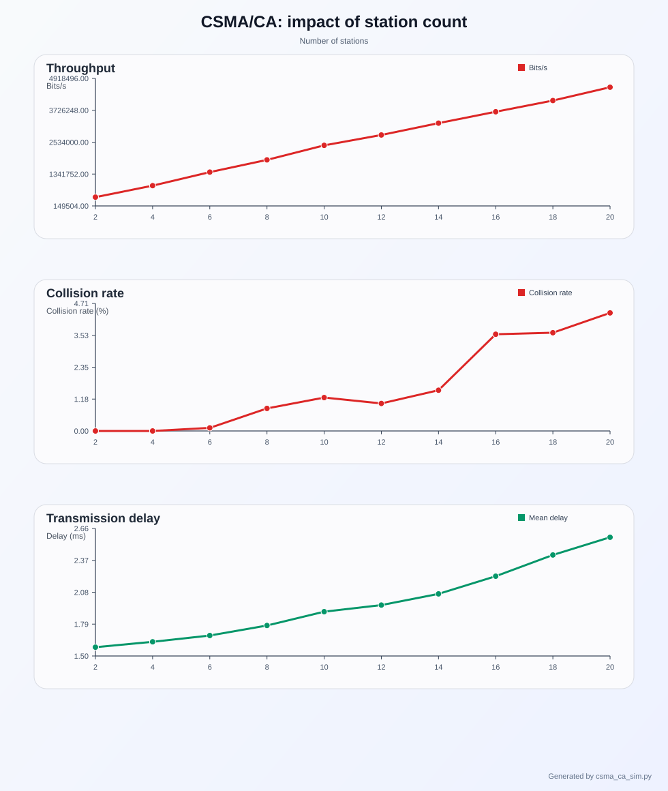
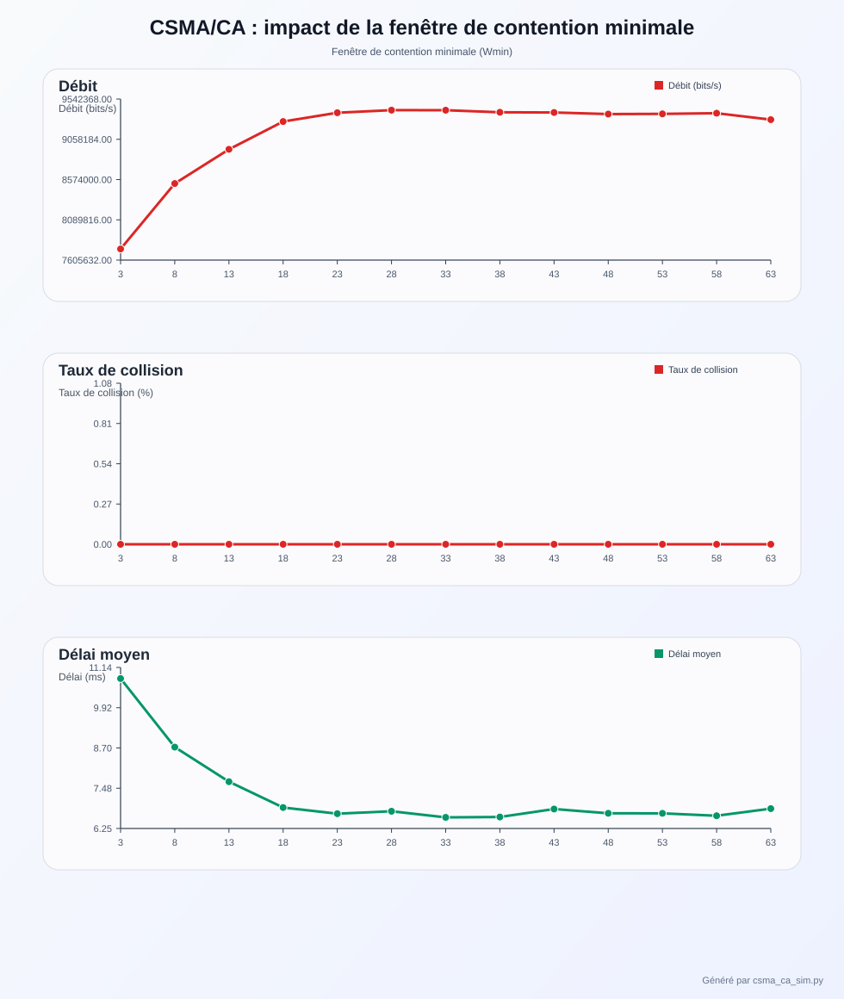
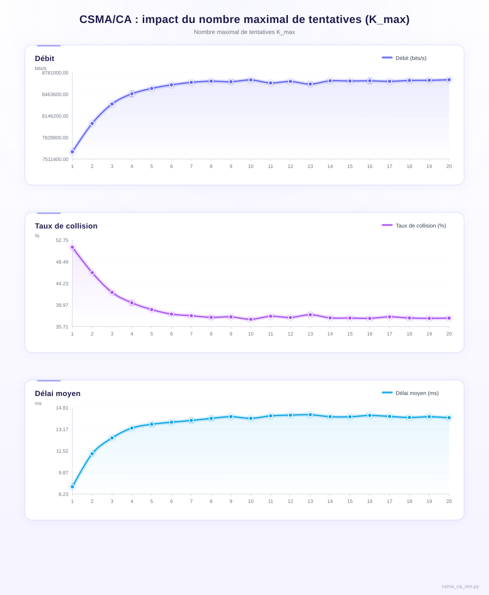

# Rapport — Simulation du protocole CSMA/CA à événements discrets

**Cours :** Réseaux Mobiles et Communications Sans Fil  
**Responsable :** Essaid Sabir, Ph.D.  
**Période :** Semaines 10–12  

---

## Table des matières

1. [Introduction](#1-introduction)
2. [Méthodologie générale et étapes de conception](#2-méthodologie-générale-et-étapes-de-conception)
3. [Résumé du protocole CSMA/CA implémenté](#3-résumé-du-protocole-csmaca-implémenté)
4. [Architecture du simulateur](#4-architecture-du-simulateur)
5. [Choix techniques](#5-choix-techniques)
6. [Résultats et analyse](#6-résultats-et-analyse)
7. [Conclusion](#7-conclusion)
8. [Annexe — Code source commenté](#8-annexe--code-source-commenté)

---

## 1. Introduction

Les réseaux sans fil reposent sur des mécanismes efficaces de partage du médium afin de permettre à plusieurs stations de communiquer sur un même canal. Parmi ces mécanismes, le protocole CSMA/CA (Carrier Sense Multiple Access with Collision Avoidance) joue un rôle central dans les réseaux de type IEEE 802.11 (Wi-Fi), en assurant une gestion équitable de l'accès au canal et en limitant les collisions.

Dans ce contexte, ce projet propose la conception et la mise en œuvre d'un simulateur à événements discrets du protocole CSMA/CA, visant à modéliser spécifiquement le fonctionnement de la couche MAC dans un environnement sans fil. Afin de simplifier le modèle, l'écoute du canal (*carrier sensing*) est réalisée en supposant que les compteurs de backoff de toutes les stations sont globalement accessibles, ce qui permet de ne pas modéliser explicitement la couche physique. Par ailleurs, l'environnement est considéré comme non persistant et les collisions ne peuvent pas être détectées pendant l'émission, mais seulement après la fin de la transmission.

L'objectif est de reproduire le comportement de plusieurs stations en compétition pour l'accès au canal et d'évaluer les performances du protocole à l'aide de différentes métriques : le débit, le taux de collision et le délai moyen de transmission. Le trafic généré par les stations est modélisé par un processus de Poisson, permettant de représenter des arrivées de paquets à caractère aléatoire et statistiquement homogène. De plus, conformément aux hypothèses simplificatrices du modèle, chaque station ne maintient qu'un seul paquet en attente à la fois et ne génère pas de nouvelle trame avant que la précédente n'ait été transmise avec succès ou abandonnée après dépassement du nombre maximal de tentatives.

Une extension intégrant le mécanisme RTS/CTS et la réservation du médium par NAV est également étudiée afin de comparer son impact sur le comportement global du système, notamment en termes de débit et de taux de collision.

Le simulateur permet d'analyser l'effet de différents paramètres du protocole : le nombre de stations, les bornes de la fenêtre de contention (W_min, W_max), le nombre maximal de retransmissions (K_max) et la durée des temporisations (DIFS, SIFS, *slot time*). Le modèle implémente en particulier l'algorithme de **backoff exponentiel binaire** (*Binary Exponential Backoff*, BEB), dans lequel la fenêtre de contention est doublée à chaque collision selon la règle W ← min(2W + 1, W_max), jusqu'à atteindre un plafond.

Le présent rapport est organisé comme suit. La section 2 présente la méthodologie générale et les étapes de conception. La section 3 résume le protocole CSMA/CA implémenté. La section 4 décrit l'architecture du simulateur. La section 5 justifie les choix techniques retenus. La section 6 présente les résultats de simulation et leur analyse. La section 7 conclut le rapport. Le code source entièrement commenté est fourni en annexe (section 8).

---

## 2. Méthodologie générale et étapes de conception

Le développement du simulateur s'appuie sur une approche progressive visant à modéliser de manière fidèle le fonctionnement du protocole CSMA/CA tout en conservant une structure simple et modulable. La méthodologie adoptée repose sur la décomposition du système en plusieurs étapes de conception clairement définies, comme illustré à la Figure 1.

> *Figure 1 — Étapes de conception du simulateur CSMA/CA (à insérer ici)*

Dans un premier temps, le choix d'un modèle à événements discrets a été retenu afin de représenter l'évolution du système dans le temps. Cette approche permet de simuler efficacement les interactions entre les différentes stations en ne traitant que les événements significatifs, tels que les arrivées de paquets, les tentatives de transmission, les mises à jour de backoff et les fins de transmission. Concrètement, ces événements sont structurés sous forme d'actions discrètes qui permettent de découper le temps en unités pertinentes, notamment le *slot time*, le DIFS et le SIFS du protocole.

Dans un deuxième temps, un modèle de station a été défini afin de représenter le comportement individuel de chaque participant du réseau. Chaque station maintient son propre état, incluant le paquet en attente, son compteur de backoff, le nombre de tentatives de retransmission ainsi que les mécanismes de temporisation liés au protocole. L'écoute du canal est réalisée de manière abstraite en supposant que les compteurs de backoff de toutes les stations sont globalement accessibles, ce qui permet de modéliser le mécanisme de *carrier sensing* sans recourir à un modèle physique détaillé. Conformément aux hypothèses du modèle, chaque station ne maintient qu'un seul paquet à la fois : aucune nouvelle trame n'est générée tant que le paquet courant n'a pas été transmis avec succès ou abandonné suite au dépassement du nombre maximal de tentatives K_max.

Dans un troisième temps, la logique du protocole CSMA/CA a été implémentée, notamment l'algorithme de backoff exponentiel binaire, la gestion des collisions et la retransmission des paquets en cas d'échec. Une extension intégrant le mécanisme RTS/CTS a également été ajoutée afin de permettre une comparaison entre différentes stratégies d'accès au médium. Le fonctionnement détaillé de cet algorithme est présenté à la Figure 2 (section 3).

Dans un quatrième temps, un ensemble d'expériences a été défini en faisant varier les paramètres du système : le nombre de stations, le taux d'arrivée des paquets, la taille de la fenêtre de contention et les temporisations (DIFS, SIFS et *slot time*). Afin d'assurer la fiabilité des résultats, chaque configuration est simulée plusieurs fois et les résultats sont moyennés, ce qui permet de réduire l'impact des fluctuations aléatoires inhérentes au modèle stochastique.

Enfin, les résultats obtenus ont été analysés à l'aide de métriques pertinentes — débit, taux de collision et délai moyen — afin d'évaluer les performances du protocole et d'identifier ses limites. L'ensemble du simulateur a été implémenté en Python, en utilisant une file de priorité (*heap*) pour la gestion des événements, garantissant un traitement chronologique cohérent.

---

## 3. Résumé du protocole CSMA/CA implémenté

Cette section décrit précisément les règles du protocole tel qu'il est implémenté dans le simulateur, en distinguant le mode de base et l'extension RTS/CTS. Les valeurs par défaut des paramètres sont celles du standard IEEE 802.11b et sont récapitulées dans le tableau suivant.

| Paramètre | Symbole | Valeur par défaut | Description |
|---|---|---|---|
| Slot time | $T_{\text{slot}}$ | 20 µs | Durée d'un slot de backoff |
| DIFS | $T_{\text{DIFS}}$ | 50 µs | Attente minimale avant toute contention |
| SIFS | $T_{\text{SIFS}}$ | 10 µs | Attente courte entre trames d'un même échange |
| Durée de paquet | $T_{\text{data}}$ | 1 ms | Durée de transmission d'une trame de données |
| Taille de paquet | — | 12 000 bits | Taille fixe de chaque trame |
| Fenêtre minimale | $W_{\min}$ | 15 | Fenêtre de contention initiale |
| Fenêtre maximale | $W_{\max}$ | 1 023 | Plafond de la fenêtre de contention |
| Tentatives max. | $K_{\max}$ | 15 | Nombre d'échecs avant abandon du paquet |
| Durée RTS | $T_{\text{RTS}}$ | 200 µs | Durée d'une trame RTS (mode RTS/CTS) |
| Durée CTS | $T_{\text{CTS}}$ | 200 µs | Durée d'une trame CTS (mode RTS/CTS) |

### 3.1 Génération du trafic

Chaque station génère des paquets de manière indépendante selon un processus de Poisson de paramètre $\lambda$ (paquets/s). Les intervalles entre arrivées sont donc distribués exponentiellement de moyenne $1/\lambda$. Conformément à l'hypothèse du sujet, **une station ne génère pas de nouveau paquet tant que le paquet courant n'a pas été transmis avec succès ou abandonné**. Le prochain événement d'arrivée n'est planifié qu'après résolution du paquet actif.

### 3.2 Phase de contention initiale

À l'arrivée d'un paquet, la station initialise ses compteurs :

$$W \leftarrow W_{\min}, \quad K \leftarrow 0, \quad b \leftarrow \text{Uniforme}[0,\, W]$$

où $b$ est le compteur de backoff tiré aléatoirement et uniformément dans la fenêtre de contention courante. La station est alors ajoutée à l'ensemble des *contendants actifs*.

### 3.3 Décrémentation du backoff et écoute du canal

Le canal est découpé en slots de durée $T_{\text{slot}}$. Avant toute contention, le canal doit rester libre pendant une durée DIFS ; ceci est modélisé par le paramètre `contention_open_time`, qui empêche tout *slot tick* avant $t_{\text{fin transmission}} + T_{\text{DIFS}}$.

À chaque *slot tick*, chaque station contendante dont le NAV est expiré décrémente son compteur :

$$b \leftarrow b - 1$$

Le canal est considéré libre de manière abstraite : si aucune transmission n'est en cours (`current_transmission = None`), les stations peuvent décrémenter. Cette hypothèse, explicitement autorisée par le sujet, évite de modéliser la propagation physique du signal.

### 3.4 Tentative de transmission

Lorsqu'une station atteint $b = 0$, elle tente de transmettre son paquet. Deux cas se présentent selon le nombre de stations ayant atteint $b = 0$ simultanément lors du même slot.

**Transmission réussie** ($|$contendants prêts$|$ $= 1$) : La trame de données est transmise pendant $T_{\text{data}}$, suivie d'un silence de $T_{\text{SIFS}}$. À la fin, la station reçoit implicitement l'acquittement et libère le canal. Ses compteurs sont réinitialisés :

$$W \leftarrow W_{\min}, \quad K \leftarrow 0$$

Une nouvelle période de contention peut démarrer après $T_{\text{DIFS}}$.

**Collision logique** ($|$contendants prêts$|$ $\geq 2$) : Plusieurs stations ont atteint $b = 0$ au même instant — c'est la définition de la collision dans ce modèle non persistant où les collisions ne peuvent être détectées que post-transmission. Chaque station impliquée incrémente son compteur de tentatives $K \leftarrow K + 1$ et applique l'algorithme de **backoff exponentiel binaire** (BEB) :

$$W \leftarrow \min(2W + 1,\; W_{\max}), \quad b \leftarrow \text{Uniforme}[0,\, W]$$

Si $K > K_{\max}$, le paquet est **abandonné** : la station réinitialise ses compteurs ($W \leftarrow W_{\min}$, $K \leftarrow 0$) et planifie l'arrivée du prochain paquet.

### 3.5 Extension RTS/CTS et mécanisme NAV

En mode RTS/CTS (activé par l'option `--rtscts`), la station ne transmet pas directement ses données quand $b = 0$ : elle envoie d'abord une trame **RTS** de durée $T_{\text{RTS}}$.

- **Collision sur le RTS** : même règle BEB que pour une collision de données.
- **RTS réussi** : le point d'accès répond par un **CTS** après $T_{\text{SIFS}}$. La durée totale réservée est :

$$t_{\text{fin données}} = t_{\text{RTS\_end}} + T_{\text{SIFS}} + T_{\text{CTS}} + T_{\text{SIFS}} + T_{\text{data}}$$

Toutes les autres stations reçoivent le CTS et positionnent leur **NAV** (*Network Allocation Vector*) à $t_{\text{fin données}}$ : elles s'interdisent toute décrémentation de backoff jusqu'à cette échéance, ce qui protège l'échange de données contre les interférences.

### 3.6 Hypothèses simplificatrices

Le modèle implémenté repose sur les hypothèses suivantes, conformes au sujet :

1. **Pas de couche physique** : l'état du canal est déduit de l'état interne du simulateur (absence de transmission en cours) ; aucun modèle de propagation n'est utilisé.
2. **Collision logique** : une collision se produit si et seulement si deux stations ou plus atteignent $b = 0$ lors du même *slot tick*.
3. **Un seul paquet par station** : aucune nouvelle trame n'est générée tant que la précédente n'est pas résolue.
4. **Pas de RTS/CTS par défaut** : le mode de base ne comprend ni réservation de canal ni NAV ; ces mécanismes sont une extension optionnelle.

---

## 4. Architecture générale du simulateur

Le simulateur développé repose sur une architecture modulaire permettant de représenter de manière structurée le fonctionnement du protocole CSMA/CA. Cette organisation facilite à la fois l'implémentation du modèle et l'analyse des interactions entre les différentes composantes du système. L'ensemble repose sur trois éléments principaux : un moteur à événements discrets, un modèle de stations et un module de calcul de métriques.

### 4.1 Moteur de simulation à événements discrets

Le cœur du simulateur repose sur un moteur à événements discrets permettant de modéliser l'évolution temporelle du système. Dans cette approche, le temps progresse de manière discontinue en fonction des événements significatifs qui surviennent : arrivée d'un paquet dans une station, progression d'un slot (*slot tick*), fin d'une transmission de données (*data end*) ou fin d'un échange RTS (*rts end*). Ce découpage en événements nommés permet de représenter précisément chaque instant pertinent de la simulation sans avoir à itérer sur chaque unité de temps.

Les événements sont gérés au moyen d'une file de priorité, implémentée à l'aide du module `heapq` de Python, qui garantit leur traitement dans l'ordre chronologique strict. Chaque entrée de la file est un n-uplet `(temps, numéro_de_séquence, type, station, jeton)`, où le numéro de séquence brise les égalités de temps de manière déterministe et le jeton permet d'invalider les événements *slot tick* périmés sans les retirer physiquement de la file.

Cette structure confère au simulateur une grande flexibilité : l'ajout d'un nouveau type d'événement (RTS/CTS, par exemple) se limite à l'ajout d'un gestionnaire dédié, sans modifier le moteur central.

### 4.2 Modèle des stations

Le simulateur considère un ensemble de stations indépendantes partageant un même canal de communication. Chaque station est représentée par un état interne `StationState` qui évolue au cours de la simulation et contient les champs suivants :

| Champ | Rôle |
|---|---|
| `packet` | Trame active en attente de transmission (`None` si la station est idle) |
| `backoff` | Valeur courante du compteur de backoff (en slots) |
| `contention_window` | Fenêtre de contention courante W |
| `retries` | Nombre de tentatives échouées pour le paquet courant |
| `nav_until` | Temps jusqu'auquel la station est bloquée par le NAV (mode RTS/CTS) |

Conformément à l'hypothèse du sujet, chaque station ne maintient qu'**un seul paquet actif à la fois**. Aucune nouvelle trame n'est générée tant que le paquet courant n'a pas été transmis avec succès ou abandonné après dépassement de K_max tentatives. Le comportement des stations est également régi par les paramètres temporels du standard IEEE 802.11 : DIFS, SIFS et *slot time*, tous paramétrables à l'exécution.

### 4.3 Implémentation du protocole CSMA/CA

La logique du protocole CSMA/CA est intégrée directement dans le comportement des stations et du moteur d'événements. Lorsqu'un paquet est prêt à être transmis, la station tire un délai de backoff aléatoire uniforme dans l'intervalle $[0, W]$ et entre en phase de contention. Ce processus repose sur une prise de décision entièrement distribuée : chaque station agit de manière autonome sans coordination centrale.

L'écoute du canal est modélisée de manière abstraite : l'état des compteurs de backoff de toutes les stations est globalement accessible, ce qui permet de détecter la disponibilité du canal sans recourir à un modèle de couche physique. Le système est non persistant ; les collisions ne sont détectées qu'après la fin de la tentative de transmission.

À chaque *slot tick*, le compteur de backoff de chaque station contendante est décrémenté d'une unité. Lorsqu'une station atteint un compteur nul, elle tente de transmettre son paquet. Une **collision logique** se produit lorsque plusieurs stations atteignent simultanément un compteur nul lors du même slot. Dans ce cas, les stations concernées déclenchent une nouvelle phase de backoff selon la règle du BEB : $W \leftarrow \min(2W + 1, W_{\max})$. Ce mécanisme adaptatif stabilise le système même sous forte charge.

> *Figure 2 — Fonctionnement du protocole CSMA/CA avec algorithme de backoff (à insérer ici)*

La figure ci-dessus illustre le flux décisionnel principal du protocole : sélection du backoff b dans [0, W] à l'arrivée du paquet (avec W = W_min initialement), décrémentation slot par slot tant que le canal est libre, tentative de transmission quand b = 0, puis bifurcation selon qu'une collision est détectée ou non. Par souci de lisibilité, la figure présente une version simplifiée ; le comportement complet implémenté dans le code comporte trois éléments supplémentaires :

1. **Attente DIFS** : après toute fin de transmission, le canal doit rester libre pendant T_DIFS avant que les stations puissent recommencer à décrémenter leur backoff.
2. **Plafond W_max** : lors d'une collision, la fenêtre de contention est doublée selon W ← min(2W + 1, W_max), ce qui garantit que W ne dépasse jamais W_max.
3. **Compteur de tentatives K / abandon** : chaque collision incrémente un compteur K. Lorsque K > K_max, le paquet est **abandonné** (comptabilisé comme perdu) et la station réinitialise ses paramètres (W ← W_min, K ← 0) avant de traiter le prochain paquet. Ce mécanisme évite qu'un paquet bloque indéfiniment le système sous forte charge.

Une extension intégrant le mécanisme **RTS/CTS** est également implémentée. Cette approche introduit une phase préalable de réservation du canal : la station gagnante envoie d'abord une trame RTS ; si aucune collision ne se produit sur le RTS, le point d'accès répond par un CTS et toutes les autres stations bloquent leur accès pendant la durée de la transmission via le mécanisme **NAV** (*Network Allocation Vector*). Ce mécanisme réduit les collisions sur les données au prix d'un surcoût en temps dû aux échanges RTS/CTS.

### 4.4 Calcul des métriques de performance

Le simulateur intègre un module de collecte et d'agrégation des métriques de performance. Trois indicateurs principaux sont calculés à la fin de chaque simulation.

**Débit** (*throughput*) — nombre de paquets ou de bits transmis avec succès par unité de temps :

$$\text{Débit} = \frac{\text{Paquets réussis}}{\text{Temps de simulation}} \quad [\text{paquets/s}]$$

$$\text{Débit binaire} = \frac{\text{Bits réussis}}{\text{Temps de simulation}} \quad [\text{bits/s}]$$

**Taux de collision** — proportion des tentatives de transmission ayant abouti à une collision :

$$\text{Taux de collision} = \frac{\text{Transmissions en collision}}{\text{Nombre total de tentatives}}$$

**Délai moyen de transmission** — temps moyen écoulé entre la génération d'un paquet et sa transmission réussie :

$$\bar{d} = \frac{\displaystyle\sum_{i=1}^{N_{\text{réussis}}} \left( t_{\text{succès},i} - t_{\text{arrivée},i} \right)}{N_{\text{réussis}}}$$

En complément, le simulateur calcule l'**utilisation du canal** (*channel utilization*), définie comme la fraction du temps de simulation pendant laquelle le médium transporte effectivement des données utiles :

$$U = \frac{N_{\text{réussis}} \times T_{\text{paquet}}}{T_{\text{simulation}}}$$

Lorsque le nombre maximal de tentatives K_max est atteint, le paquet est abandonné et comptabilisé dans les statistiques de paquets perdus. Ces métriques offrent ainsi une vision globale des performances du système et constituent la base quantitative de l'analyse expérimentale présentée en section 6.

---

## 5. Choix techniques

Le développement du simulateur a nécessité plusieurs choix techniques visant à assurer la simplicité de l'implémentation, la clarté du modèle et la reproductibilité des résultats.

**Langage Python.** Le simulateur a été implémenté en Python, un langage largement utilisé en informatique scientifique et adapté au prototypage rapide. Sa syntaxe claire permet de structurer le code de façon modulaire, ce qui facilite la maintenance et l'extension du simulateur. Les types de données natifs (`dataclass`, `heapq`, `random`) couvrent tous les besoins du modèle sans dépendances externes.

**Simulation à événements discrets.** Cette approche, décrite en détail à la section 4.1, a été retenue afin de modéliser le comportement du système sans itérer sur chaque instant de temps. Seuls les événements significatifs sont traités, ce qui rend la simulation efficace même pour des horizons de temps longs.

**File de priorité (`heapq`).** Les événements sont ordonnés selon leur instant d'occurrence grâce au module `heapq` de Python. Un numéro de séquence monotone est ajouté à chaque entrée de la file afin de rompre les égalités de temps de manière déterministe, garantissant ainsi un ordre de traitement stable et reproductible.

**Modèle MAC simplifié.** L'écoute du canal (*carrier sensing*) est réalisée de manière abstraite en supposant que les compteurs de backoff de toutes les stations sont globalement accessibles, ce qui évite de modéliser la couche physique. Conformément au sujet, chaque station ne maintient qu'un seul paquet actif à la fois ; aucune nouvelle trame n'est générée tant que le paquet courant n'est pas résolu, ce qui simplifie la logique d'état sans affecter la fidélité du modèle MAC.

**Reproductibilité.** La possibilité de fixer une graine aléatoire (`--seed`) rend les simulations entièrement déterministes. L'exécution répétée de chaque scénario (`--runs`) avec calcul de la moyenne réduit l'impact des fluctuations statistiques.

**Configurabilité.** Tous les paramètres du système sont exposés en ligne de commande (nombre de stations, taux d'arrivée, durée de simulation, DIFS, SIFS, *slot time*, W_min, W_max, K_max, RTS/CTS), ce qui rend le simulateur directement utilisable pour les expérimentations sans modifier le code source.

---

## 6. Résultats et analyse

Afin d'évaluer les performances du simulateur, plusieurs séries d'expériences ont été réalisées en faisant varier le nombre de stations et les conditions de charge du réseau. Chaque scénario a été exécuté plusieurs fois (`--runs 3`) et les résultats ont été moyennés afin de réduire les fluctuations dues au caractère stochastique de la simulation. Les métriques analysées sont le débit moyen (en bits par seconde), le taux moyen de collision et le délai moyen de transmission.

### 6.1 Cas standard

La Figure 3 présente les résultats obtenus en faisant varier le nombre de stations de 2 à 20, avec un taux d'arrivée standard.



> *Figure 3 — Performances du protocole CSMA/CA en fonction du nombre de stations (cas standard)*

On observe que le débit augmente de manière quasi linéaire avec le nombre de stations, atteignant environ 4,9 Mbps pour 20 stations. Cette évolution s'explique par l'augmentation progressive de la charge globale offerte au réseau. Dans ce régime de charge modérée, le protocole CSMA/CA gère efficacement la contention grâce au mécanisme de backoff et à l'espacement entre les transmissions.

Le délai moyen reste faible et n'augmente que légèrement, passant d'environ 1,18 ms à 1,64 ms, ce qui indique que l'accès au canal demeure fluide. Le taux de collision est quasi nul, confirmant que la probabilité de conflit est très faible dans ce scénario. Cette stabilité s'explique en partie par le fait que chaque station ne traite qu'un seul paquet à la fois, ce qui limite la pression exercée sur le canal.

### 6.2 Forte charge

Une seconde série d'expériences a été réalisée avec un taux d'arrivée de paquets plus élevé (`--arrival-rate 60`). Les résultats sont présentés à la Figure 4.



> *Figure 4 — Performances du protocole CSMA/CA en situation de forte charge*

Dans ce scénario, le débit tend à atteindre un plateau à partir d'un certain nombre de stations, se stabilisant autour de 9,5 Mbps, ce qui traduit une saturation du canal. Le délai moyen de transmission augmente fortement, atteignant plus de 11 ms pour 20 stations. Ce phénomène est directement lié à l'algorithme de backoff exponentiel binaire : à chaque collision, la fenêtre de contention est doublée selon la règle

$$W \leftarrow \min(2W + 1, W_{\max})$$

ce qui entraîne des temps d'attente de plus en plus longs à mesure que la charge augmente.

Contrairement à ce que l'on pourrait attendre, le taux de collision reste très faible dans ce régime saturé. Ce phénomène s'explique par la mécanique de convergence du BEB. Après quelques collisions initiales, la fenêtre W croît rapidement (W ← min(2W + 1, W_max)) jusqu'à atteindre des valeurs proches de W_max = 1023. En régime stationnaire, la probabilité qu'au moins deux stations tirent b = 0 simultanément devient alors négligeable : avec n = 20 stations et W ≈ 1023, cette probabilité est de l'ordre de $\binom{20}{2} / W \approx 0{,}18\,\%$. C'est pourquoi le taux de collision mesuré est quasi nul.

En revanche, le délai moyen est élevé car le compteur de backoff moyen vaut $\bar{b} = W/2 \approx 511$ slots, soit une attente théorique de $511 \times 20\,\mu\text{s} \approx 10{,}2\,\text{ms}$ — ce qui correspond précisément aux ~11 ms observés. En d’autres termes, **la dégradation des performances sous forte charge est une dégradation de délai par contention, pas par collision**.

### 6.3 Impact du mécanisme RTS/CTS

Une comparaison avec l'extension RTS/CTS a été effectuée afin d'évaluer l'impact de ce mécanisme sur les performances du système. Les résultats sont illustrés à la Figure 5.



> *Figure 5 — Performances du protocole CSMA/CA avec mécanisme RTS/CTS*

L'introduction du mécanisme RTS/CTS modifie le fonctionnement du protocole en ajoutant une phase de réservation du canal. Le vecteur d'allocation réseau (NAV) permet d'éviter certaines collisions en bloquant temporairement l'accès au canal pour les autres stations une fois le RTS accepté.

Cependant, ce mécanisme introduit un surcût lié à l'échange des trames RTS et CTS. Ce surcût peut être quantifié précisément : la durée totale d'un échange réussi avec RTS/CTS est :

$$T_{\text{échange}} = T_{\text{RTS}} + T_{\text{SIFS}} + T_{\text{CTS}} + T_{\text{SIFS}} + T_{\text{data}} = 200 + 10 + 200 + 10 + 1000 = 1420\,\mu\text{s}$$

Sans RTS/CTS, la durée est simplement $T_{\text{data}} + T_{\text{SIFS}} = 1010\,\mu\text{s}$. Le surcût introduit est donc :

$$\text{Overhead} = \frac{1420 - 1010}{1010} \approx 40{,}6\,\%$$

Cette surcharge de ~41 % explique directement la réduction de débit observée (de ~9,5 Mbps à ~4,9 Mbps). Le délai de transmission augmente également en raison de ces étapes supplémentaires. Par ailleurs, des collisions peuvent encore se produire au niveau des trames RTS elles-mêmes, ce qui se traduit par un taux de collision atteignant environ 4,7 % pour 20 stations.

Conformément au cours (Module 4 — IEEE 802.11), le mécanisme RTS/CTS a été conçu pour résoudre le **problème des terminaux cachés** (*hidden terminal problem*) : deux stations A et C hors de portée l'une de l'autre peuvent toutes deux « entendre » le point d'accès et entrer en collision sans s'en apercevoir. Dans ce contexte, le CTS diffusé par le point d'accès avertit toutes les stations à sa portée et évite les interférences. Notre modèle simplifiant ne comportant pas de terminaux cachés, cet avantage n'est pas activé, ce qui explique la dégradation nette des performances.

Ainsi, dans un environnement simplifié sans terminal caché, l'utilisation de RTS/CTS ne permet pas nécessairement d'améliorer les performances et peut même les dégrader en raison du surcoût introduit.

### 6.4 Impact de la fenêtre de contention minimale (W_min)

Cette série d'expériences évalue l'influence de la fenêtre de contention minimale W_min sur les performances du système. Le nombre de stations est fixé à 15, le taux d'arrivée à 80 paquets/s/station (charge élevée), et W_min est fait varier de 3 à 63 par pas de 5. Trois répétitions sont moyennées pour chaque point.



> *Figure 6 — Impact de la fenêtre de contention minimale W_min sur le débit, le taux de collision et le délai moyen (15 stations, taux d'arrivée = 80 paquets/s)*

Les résultats révèlent un compromis net lié au choix de W_min :

**Très petite fenêtre (W_min = 3)** : le délai moyen atteint 10,8 ms et le débit n'est que de 7,7 Mbps. Avec une fenêtre initiale aussi étroite, les stations tirent un backoff dans [0, 3], ce qui crée de fréquentes collisions initiales dès les premiers slots. Chaque collision déclenche l'algorithme BEB (W ← min(2W + 1, W_max)), qui double progressivement la fenêtre. Le système finit par se stabiliser, mais au prix d'une phase transitoire coûteuse en temps et en tentatives.

**Zone optimale (W_min ≈ 23–33)** : le délai descend à son minimum (~6,6 ms) et le débit atteint son plateau (~9,4 Mbps). Dans cette plage, la fenêtre initiale est suffisamment grande pour espacer naturellement les stations et éviter la plupart des collisions dès le premier essai, sans pour autant imposer une attente excessive en l'absence de contention.

**Grande fenêtre (W_min = 63)** : le débit redescend légèrement (~9,3 Mbps) et le délai remonte (~6,9 ms). Une fenêtre initiale trop large oblige les stations à attendre des backoffs inutilement longs même lorsque le canal est peu chargé, réduisant l'efficacité du canal.

Ce résultat illustre directement la logique derrière le choix de W_min = 15 dans le standard IEEE 802.11b : cette valeur se situe dans la zone de performance optimale pour les niveaux de charge typiques d'un réseau Wi-Fi domestique.

### 6.5 Impact du nombre maximal de tentatives (K_max)

Cette expérience évalue l'influence du paramètre K_max sur les performances du système. Le nombre de stations est fixé à 12, le taux d'arrivée à 80 paquets/s/station (charge élevée), et K_max est fait varier de 1 à 20 par pas de 1. Trois répétitions sont moyennées pour chaque point.



> *Figure 7 — Impact du nombre maximal de tentatives K_max sur le débit, le taux de collision et le délai moyen (12 stations, taux d’arrivée = 80 paquets/s)*

K_max définit le nombre maximal d'échecs tolérés avant qu'un paquet soit **abandonné**. Il gouverne un compromis fondamental entre perte de paquets et délai moyen.

**K_max = 1 (abandon immédiat)** : le délai moyen est minimal (3,24 ms) mais 127 paquets sont abandonnés sur les 5 secondes de simulation avec la graine de référence, soit un taux de perte d'environ 3,3 %. Ce faible délai est en partie un **biais de sélection** : seuls les paquets ayant réussi dès leur première ou deuxième tentative contribuent au calcul, tandis que les paquets « difficiles » sont simplement supprimés.

**K_max croissant (3 à 15)** : le délai moyen augmente progressivement de 3,8 ms à environ 3,9 ms tandis que le taux de perte tend vers zéro. Le BEB a suffisamment de tentatives pour laisser la fenêtre W converger vers des valeurs élevées, réduisant la probabilité de collision à presque 0 et permettant la transmission éventuelle de presque tous les paquets. Pour K_max ≥ 8, aucun paquet n'est abandonné dans les conditions de cette expérience.

**K_max élevé (≥ 15)** : le délai et le débit se stabilisent (écart < 3 %). Au-delà d'un certain seuil, le BEB a déjà atteint W_max et les tentatives supplémentaires n'apportent plus de bénéfice mesurable, tout en consommant des ressources du canal.

La valeur K_max = 15 du standard IEEE 802.11b représente donc un équilibre : assez de tentatives pour garantir un taux de perte quasi nul sous charge normale, sans imposer un délai disproportionné.

### 6.6 Interprétation générale

Les résultats obtenus mettent en évidence plusieurs tendances importantes :

- **Débit** : il croît avec le nombre de stations jusqu'à saturation du canal, reflétant la capacité finie du médium partagé à absorber un trafic croissant.
- **Délai** : il augmente progressivement avec la charge en raison de la contention accrue et de l'allongement des fenêtres de backoff. En régime saturé, la dégradation est principalement causée par l'attente en backoff (b ≈ W/2 slots) et non par les collisions.
- **Taux de collision** : il reste faible en mode standard grâce à la convergence rapide du BEB vers W_max, mais devient non négligeable sur les trames RTS en mode RTS/CTS.
- **RTS/CTS** : sans terminaux cachés, le bénéfice est limité et le surcût de ~41 % par échange ne compense pas la réduction de collisions sur les données.
- **W_min** : il existe une valeur optimale (~23–33) qui équilibre le risque de collision initiale et l'attente inutile ; le standard 802.11b choisit W_min = 15, proche de cet optimum.
- **K_max** : il contrôle le compromis entre perte de paquets et délai. K_max trop faible (< 8 dans nos conditions) entraîne des abandons de paquets ; K_max trop grand au-delà du seuil de convergence n'apporte plus de bénéfice mesurable.

Dans l'ensemble, ces résultats confirment l'efficacité du protocole CSMA/CA pour la gestion de la contention sous charge modérée, et illustrent les compromis inhérents entre débit, délai et gestion des conflits lorsque la charge augmente.

---

## 7. Conclusion

Ce projet a permis de développer un simulateur à événements discrets du protocole CSMA/CA, reproduisant les principaux mécanismes de gestion de l'accès au médium dans les réseaux sans fil. À travers cette implémentation, il a été possible de modéliser le comportement de plusieurs stations en compétition pour un canal partagé et d'évaluer les performances du système à l'aide de métriques pertinentes.

Les résultats expérimentaux obtenus mettent en évidence le fonctionnement global du protocole ainsi que ses limites. En particulier, l'augmentation du nombre de stations ou de la charge du réseau entraîne une forte hausse du délai due à la contention, tandis que le taux de collision reste globalement maîtrisé grâce au mécanisme de backoff exponentiel binaire. L'exception notable concerne les trames de contrôle RTS, qui ne bénéficient pas de protection préalable.

L'étude du mécanisme RTS/CTS montre qu'il introduit un compromis entre la réduction des collisions sur les données et la surcharge induite par les échanges supplémentaires. Dans un environnement simplifié sans terminaux cachés, ce mécanisme n'améliore pas nécessairement les performances globales et peut entraîner une augmentation du délai ainsi qu'une réduction du débit utile.

Dans l'ensemble, ce projet a permis de mieux comprendre les principes de fonctionnement du protocole CSMA/CA et les enjeux liés au partage du médium dans les réseaux sans fil. Le simulateur constitue un outil pertinent pour analyser le comportement du protocole et explorer différents scénarios de communication.

---

## Bibliographie

- Python Software Foundation. (2026). *Python Documentation*. Consulté à l'adresse https://docs.python.org

- Sabir, E. (2026). *Notes de cours — Réseaux Mobiles et Communications Sans Fil*. Université TÉLUQ.

- IEEE Computer Society. (2020). *IEEE Std 802.11-2020 — IEEE Standard for Information Technology: Wireless LAN Medium Access Control (MAC) and Physical Layer (PHY) Specifications*. IEEE. https://ieeexplore.ieee.org/document/9363693

---

## 8. Annexes

### Annexe A — Commandes de génération des graphiques

Cette annexe présente les commandes utilisées pour générer les graphiques illustrant les performances du simulateur.

**Graphique 1 — Variation du nombre de stations (cas standard)**

```bash
python csma_ca_sim.py --sweep-stations 2 20 2 --runs 3 --simulation-time 5 --output Graphiques/stations.svg
```

| Option | Effet |
|---|---|
| `--sweep-stations 2 20 2` | Fait varier N de 2 à 20 par pas de 2 |
| `--runs 3` | Répète chaque configuration 3 fois et calcule la moyenne |
| `--simulation-time 5` | Durée de simulation de 5 secondes |
| `--output Graphiques/stations.svg` | Enregistre le graphique SVG |

**Graphique 2 — Forte charge**

```bash
python csma_ca_sim.py --sweep-stations 2 20 2 --arrival-rate 60 --runs 3 --simulation-time 5 --output Graphiques/high_load.svg
```

| Option | Effet |
|---|---|
| `--arrival-rate 60` | Simule une charge élevée (60 paquets/s/station) |

**Graphique 3 — Mécanisme RTS/CTS**

```bash
python csma_ca_sim.py --sweep-stations 2 20 2 --rtscts --runs 3 --simulation-time 5 --output Graphiques/rtscts.svg
```

| Option | Effet |
|---|---|
| `--rtscts` | Active le mécanisme RTS/CTS et la réservation NAV |

**Graphique 4 — Impact de la fenêtre de contention minimale W_min**

```bash
python csma_ca_sim.py --sweep-wmin 3 63 5 --stations 15 --arrival-rate 80 --runs 3 --simulation-time 5 --output Graphiques/wmin.svg
```

| Option | Effet |
|---|---|
| `--sweep-wmin 3 63 5` | Fait varier W_min de 3 à 63 par pas de 5 |
| `--stations 15` | 15 stations pour générer une contention visible |
| `--arrival-rate 80` | Charge élevée pour amplifier l'impact de W_min |

**Graphique 5 — Impact du nombre maximal de tentatives K_max**

```bash
python csma_ca_sim.py --sweep-kmax 1 20 1 --stations 12 --arrival-rate 80 --runs 3 --simulation-time 5 --output Graphiques/kmax.svg
```

| Option | Effet |
|---|---|
| `--sweep-kmax 1 20 1` | Fait varier K_max de 1 à 20 par pas de 1 |
| `--stations 12` | Charge suffisante pour observer les abandons à faible K_max |
| `--arrival-rate 80` | Charge élevée pour rendre le compromis perte/délai visible |

---

### Annexe B — Dépôt GitHub

Le code source complet du simulateur, les scripts de génération des graphiques et les fichiers de configuration CI/CD sont disponibles à l'adresse suivante :

**[moyamelissa/Mobile-Networks-and-Wireless-Communications](https://github.com/moyamelissa/Mobile-Networks-and-Wireless-Communications)**

Le dépôt inclut :
- `csma_ca_sim.py` — simulateur principal
- `test_csma_ca_sim.py` — suite de tests automatisés (84 tests)
- `README.md` — documentation d'utilisation
- `Graphiques/` — graphiques SVG générés
- `.github/workflows/` — configuration CI/CD

---

### Annexe C — Code source intégralement commenté

Le code source complet du simulateur (`csma_ca_sim.py`, 1138 lignes) est reproduit ci-dessous. Chaque module, classe, méthode et champ de données est documenté conformément à la consigne.

```python
"""Simulateur à événements discrets du protocole CSMA/CA.

Ce module implémente la logique MAC du protocole CSMA/CA (Carrier Sense Multiple
Access with Collision Avoidance) tel que défini par le standard IEEE 802.11.
Il supporte le mode de base et une extension RTS/CTS avec mécanisme NAV.

Usage typique (ligne de commande) :
    python csma_ca_sim.py --stations 8 --arrival-rate 20 --simulation-time 20
    python csma_ca_sim.py --sweep-stations 2 20 2 --runs 3 --output resultats.svg

Structure principale :
    SimulationConfig  — paramètres de la simulation (fenêtres, temporisations, etc.)
    StationState      — état MAC d'une station individuelle
    CSMACASimulator   — moteur à événements discrets
    run_single_experiment / average_results / sweep_* — utilitaires d'expérimentation
    plot_points       — génération de graphiques SVG
    main              — point d'entrée en ligne de commande
"""
from __future__ import annotations

import argparse
import heapq
import math
import random
from dataclasses import dataclass as _dataclass

# Le paramètre `slots` de `dataclass` n'existe qu'à partir de Python 3.10.
# Cette compatibilité permet de garder un seul code source pour la CI en 3.8/3.9
# et les environnements locaux plus récents ; si `slots` n'est pas disponible,
# on le retire simplement.
_DATACLASS_SUPPORTS_SLOTS = True
try:
    # On crée une dataclass de test pour savoir si l'interpréteur gère `slots`.
    _dataclass(slots=True)(type("_X", (), {}))
except TypeError:
    _DATACLASS_SUPPORTS_SLOTS = False


def dataclass_compat(**kwargs):
    """Crée un décorateur @dataclass compatible Python 3.8+ en retirant `slots` si nécessaire."""
    if not _DATACLASS_SUPPORTS_SLOTS and "slots" in kwargs:
        kwargs = {k: v for k, v in kwargs.items() if k != "slots"}
    return _dataclass(**kwargs)
from pathlib import Path
from statistics import mean
from xml.sax.saxutils import escape
from typing import Optional


# ---------------------------------------------------------------------------
# Constantes — types d'événements du moteur de simulation
# ---------------------------------------------------------------------------
# Chaque constante identifie un type d'événement inséré dans la file de priorité.
# Utiliser des constantes nommées (plutôt que des entiers) rend le code lisible
# et facilite le débogage.
EVENT_ARRIVAL  = "arrival"    # Arrivée d'un nouveau paquet dans une station
EVENT_SLOT_TICK = "slot_tick" # Déclenchement d'un slot de backoff
EVENT_RTS_END  = "rts_end"    # Fin de l'émission d'une trame RTS (mode RTS/CTS)
EVENT_DATA_END = "data_end"   # Fin de l'émission d'une trame de données


def next_slot_boundary(time_value: float, slot_time: float) -> float:
    """Retourne le prochain instant aligné sur une borne de slot.

    Le décalage de 1e-15 s évite qu'un instant déjà exactement aligné
    (flottant) soit arrondi au slot suivant à cause des erreurs de précision.

    Args:
        time_value: Instant courant (en secondes).
        slot_time:  Durée d'un slot (en secondes, doit être > 0).

    Returns:
        Le plus petit multiple de slot_time supérieur ou égal à time_value.

    Raises:
        ValueError: Si slot_time <= 0.
    """
    if slot_time <= 0:
        raise ValueError("slot_time must be positive")
    scaled = (time_value - 1e-15) / slot_time
    slot_index = math.ceil(scaled)
    return max(0.0, slot_index * slot_time)


@dataclass_compat(slots=True)
class SimulationConfig:
    """Paramètres globaux de la simulation.

    Regroupe toutes les hypothèses MAC et temporelles qui pilotent le modèle.
    Les valeurs par défaut correspondent au standard IEEE 802.11b.
    """
    station_count: int = 8        # Nombre de stations en compétition pour le canal
    arrival_rate: float = 20.0    # Taux d'arrivée Poisson par station (paquets/s)
    simulation_time: float = 20.0 # Horizon de simulation (secondes)
    packet_bits: int = 12000      # Taille d'un paquet (bits) — 12 000 bits = 1 500 octets
    packet_duration: float = 0.001 # Durée de transmission d'un paquet (secondes)
    slot_time: float = 20e-6      # Durée d'un slot de backoff (secondes)
    difs: float = 50e-6           # DIFS : délai inter-trames distribué (secondes)
    sifs: float = 10e-6           # SIFS : délai inter-trames court (secondes)
    wmin: int = 15                # Fenêtre de contention minimale W_min
    wmax: int = 1023              # Fenêtre de contention maximale W_max
    kmax: int = 15                # Nombre maximal de tentatives avant abandon du paquet
    seed: Optional[int] = None    # Graine aléatoire (None = non déterministe)
    rtscts: bool = False          # Active le mécanisme RTS/CTS et le NAV si True
    rts_duration: float = 200e-6  # Durée d'une trame RTS (secondes)
    cts_duration: float = 200e-6  # Durée d'une trame CTS (secondes)


@dataclass_compat(slots=True)
class PacketState:
    """Représente une trame en attente de transmission dans une station.

    Une instance est créée à chaque arrivée de paquet et détruite après
    transmission réussie ou abandon (K > K_max).
    """
    arrival_time: float  # Instant de génération du paquet — sert à calculer le délai moyen
    attempts: int = 0   # Nombre de tentatives de transmission déjà effectuées pour ce paquet


@dataclass_compat(slots=True)
class StationState:
    """État MAC d'une station individuelle.

    Le sujet impose qu'une station MAC ne garde qu'une seule trame à la fois :
    `packet` est None quand la station est inactive, ou contient l'unique trame
    en cours de transmission (attente de succès ou d'abandon).
    `contention_window`, `backoff` et `retries` pilotent l'algorithme BEB.
    `nav_until` matérialise la réservation du médium par le mécanisme NAV (RTS/CTS).
    """
    station_id: int                      # Identifiant unique de la station (index dans la liste)
    packet: Optional[PacketState] = None # Trame active (None = station inactive)
    contention_window: int = 0           # Fenêtre de contention courante W ∈ [W_min, W_max]
    backoff: int = 0                     # Compteur de backoff courant b ∈ [0, W]
    retries: int = 0                     # Nombre de tentatives échouées pour la trame courante (K)
    nav_until: float = 0.0               # Instant jusqu'auquel le médium est réservé (NAV)


@dataclass_compat(slots=True)
class SimulationResult:
    """Résultats agrégés produits à la fin d'une simulation.

    Retourné par run_single_experiment() et average_results().
    Utilisé pour l'affichage console (print_result) et les graphiques (plot_points).
    """
    throughput_packets_per_s: float   # Débit en paquets transmis avec succès par seconde
    throughput_bits_per_s: float      # Débit binaire utile (bits/s)
    channel_utilization: float        # Fraction du temps où le canal transporte des données utiles
    offered_load_packets_per_s: float # Charge offerte totale (paquets générés / s)
    collision_rate: float             # Proportion des tentatives ayant abouti à une collision
    mean_delay_s: float               # Délai moyen entre génération et transmission réussie (s)
    generated_packets: int            # Nombre total de paquets générés durant la simulation
    successful_packets: int           # Nombre de paquets transmis avec succès
    dropped_packets: int              # Nombre de paquets abandonnés (K > K_max)
    total_attempts: int               # Nombre total de tentatives de transmission
    collided_packets: int             # Nombre de tentatives ayant abouti à une collision


@dataclass_compat(slots=True)
class ExperimentPoint:
    """Un point de courbe expérimentale : une valeur de paramètre et les métriques associées.

    Produit par sweep_stations() et sweep_wmin() ; consommé par plot_points().
    """
    x_value: int                       # Valeur du paramètre balayé (ex. nombre de stations)
    throughput_packets_per_s: float    # Débit moyen (paquets/s)
    throughput_bits_per_s: float       # Débit binaire moyen (bits/s)
    collision_rate: float              # Taux de collision moyen
    mean_delay_s: float                # Délai moyen de transmission (secondes)


class CSMACASimulator:
    """Moteur à événements discrets du protocole CSMA/CA.

    Gère la file de priorité des événements, l'état de chaque station,
    l'état global du canal et les compteurs de métriques.
    Instancier puis appeler run() pour obtenir un SimulationResult.
    """

    def __init__(self, config: SimulationConfig):
        """Initialise le simulateur avec la configuration donnée.

        Args:
            config: Paramètres de la simulation (voir SimulationConfig).
        """
        self.config = config
        # Générateur aléatoire isolé — garantit la reproductibilité via config.seed.
        self.random = random.Random(config.seed)
        # Une instance StationState par station participant à la contention.
        self.stations = [StationState(station_id=index) for index in range(config.station_count)]

        # File de priorité (min-heap) : chaque entrée est un tuple
        # (temps, sequence, type_événement, station_id, jeton).
        # Le numéro de séquence monotone brise les égalités de temps de façon déterministe.
        self.event_queue: list[tuple[float, int, str, int, Optional[int]]] = []
        self.sequence = 0  # Compteur global pour le numéro de séquence des événements

        # Ensemble des identifiants de stations actuellement en phase de backoff actif.
        self.contenders: set[int] = set()
        # Ensemble des stations engagées dans la transmission en cours (None si canal libre).
        # Si len > 1, une collision est en cours.
        self.current_transmission: Optional[set[int]] = None
        # Instant à partir duquel la contention peut reprendre (après DIFS).
        self.contention_open_time = 0.0
        # Instant planifié pour le prochain slot_tick (None si aucun planifié).
        self.scheduled_slot_tick_time: Optional[float] = None
        # Jeton permettant d'invalider les événements slot_tick périmés sans les retirer de la file.
        self.slot_tick_token = 0
        # Champ réservé pour une extension future (NAV global) — non utilisé dans la version courante.
        self.nav_until: float = 0.0

        # Compteurs de métriques — cumulés au fil des événements, agrégés dans run().
        self.generated_packets = 0   # Paquets générés par les stations
        self.successful_packets = 0  # Paquets transmis avec succès
        self.dropped_packets = 0     # Paquets abandonnés après K_max tentatives
        self.total_attempts = 0      # Tentatives de transmission totales
        self.collided_packets = 0    # Tentatives ayant abouti à une collision
        self.successful_bits = 0     # Bits utiles transmis (pour le débit binaire)
        self.delay_sum = 0.0         # Somme des délais individuels (pour la moyenne)

    def run(self) -> SimulationResult:
        """Lance la simulation et retourne les métriques agrégées.

        1. Planifie la première arrivée de paquet pour chaque station.
        2. Traite les événements en ordre chronologique jusqu'à épuisement de la file.
        3. Calcule et retourne les métriques de performance.

        Returns:
            SimulationResult contenant débit, taux de collision, délai moyen, etc.
        """
        # Planification des premières arrivées : chaque station commence avec
        # un premier paquet tiré selon la loi exponentielle de paramètre arrival_rate.
        for station_id in range(self.config.station_count):
            first_arrival = self._sample_interarrival()
            if first_arrival <= self.config.simulation_time:
                self._push_event(first_arrival, EVENT_ARRIVAL, station_id)

        # Boucle principale : dépile et traite chaque événement en ordre chronologique.
        while self.event_queue:
            time_value, _, event_type, station_id, token = heapq.heappop(self.event_queue)

            if event_type == EVENT_SLOT_TICK:
                if token != self.slot_tick_token:
                    continue
                self.scheduled_slot_tick_time = None

            if event_type == EVENT_ARRIVAL:
                self._handle_arrival(time_value, station_id)
            elif event_type == EVENT_SLOT_TICK:
                self._handle_slot_tick(time_value)
            elif event_type == EVENT_RTS_END:
                self._handle_rts_end(time_value)
            elif event_type == EVENT_DATA_END:
                self._handle_data_end(time_value)
            else:
                raise RuntimeError(f"Unknown event type: {event_type}")

        # --- Calcul des métriques finales ---
        # Débit en paquets et en bits : rapporte les succès à la durée de simulation.
        throughput_packets_per_s = self.successful_packets / self.config.simulation_time if self.config.simulation_time > 0 else 0.0
        throughput_bits_per_s = self.successful_bits / self.config.simulation_time if self.config.simulation_time > 0 else 0.0
        # Utilisation du canal : fraction du temps effectivement occupé par des données utiles.
        channel_utilization = (
            (self.successful_packets * self.config.packet_duration) / self.config.simulation_time
            if self.config.simulation_time > 0 and self.config.packet_duration > 0
            else 0.0
        )
        # Charge offerte : paquets générés par unité de temps (inclut succès + abandons).
        offered_load_packets_per_s = self.generated_packets / self.config.simulation_time if self.config.simulation_time > 0 else 0.0
        # Taux de collision : proportion des tentatives ayant abouti à un conflit.
        collision_rate = self.collided_packets / self.total_attempts if self.total_attempts > 0 else 0.0
        # Délai moyen : moyenne des délais individuels (génération → succès).
        mean_delay_s = self.delay_sum / self.successful_packets if self.successful_packets > 0 else 0.0

        return SimulationResult(
            throughput_packets_per_s=throughput_packets_per_s,
            throughput_bits_per_s=throughput_bits_per_s,
            channel_utilization=channel_utilization,
            offered_load_packets_per_s=offered_load_packets_per_s,
            collision_rate=collision_rate,
            mean_delay_s=mean_delay_s,
            generated_packets=self.generated_packets,
            successful_packets=self.successful_packets,
            dropped_packets=self.dropped_packets,
            total_attempts=self.total_attempts,
            collided_packets=self.collided_packets,
        )

    def _push_event(self, time_value: float, event_type: str, station_id: int, token: Optional[int] = None) -> None:
        """Insère un événement dans la file de priorité.

        Le numéro de séquence monotone garantit un ordre stable lorsque deux
        événements partagent le même instant (tri secondaire déterministe).
        """
        self.sequence += 1
        heapq.heappush(self.event_queue, (time_value, self.sequence, event_type, station_id, token))

    def _sample_interarrival(self) -> float:
        """Tire un intervalle inter-arrivée selon la loi exponentielle (processus de Poisson).

        Retourne math.inf si arrival_rate <= 0, ce qui désactive les arrivées.
        """
        if self.config.arrival_rate <= 0:
            return math.inf
        return self.random.expovariate(self.config.arrival_rate)

    def _sample_backoff(self, contention_window: int) -> int:
        """Tire un compteur de backoff b uniformément dans [0, contention_window].

        Conforme à la règle IEEE 802.11 : b = U[0, W] où W est la fenêtre courante.
        """
        return self.random.randint(0, contention_window)

    def _prime_station_for_contention(self, station_id: int, current_time: float) -> None:
        """Initialise les compteurs d'une station et l'enregistre comme contendante.

        Appelé à l'arrivée d'un nouveau paquet. Réinitialise W à W_min, K à 0,
        tire un backoff initial et déclenche le prochain slot_tick si le canal est libre.
        """
        station = self.stations[station_id]
        if station.packet is None:
            return  # Sécurité : ne rien faire si la station n'a pas de paquet actif

        # Initialisation conforme à IEEE 802.11 : W_min et K=0 pour le premier essai.
        station.contention_window = self.config.wmin
        station.retries = 0
        station.backoff = self._sample_backoff(station.contention_window)
        self.contenders.add(station_id)

        # Déclenche le slot_tick seulement si aucune transmission n'est en cours.
        if self.current_transmission is None:
            self._schedule_slot_tick_if_needed(current_time)

    def _schedule_next_arrival(self, station_id: int, base_time: float) -> None:
        """Planifie la prochaine arrivée de paquet pour une station.

        Conforme à l'hypothèse du sujet : la station ne génère un nouveau paquet
        qu'après résolution (succès ou abandon) du paquet précédent.
        L'événement n'est pas planifié si l'instant calculé dépasse l'horizon de simulation.
        """
        next_arrival = base_time + self._sample_interarrival()
        if next_arrival <= self.config.simulation_time:
            self._push_event(next_arrival, EVENT_ARRIVAL, station_id)

    def _schedule_slot_tick_if_needed(self, current_time: float) -> None:
        """Planifie le prochain événement slot_tick si les conditions le permettent.

        Un slot_tick ne peut être planifié que si :
        - aucune transmission n'est en cours (canal libre), et
        - au moins une station est en phase de backoff actif.

        Le mécanisme de jeton (slot_tick_token) permet d'invalider les slot_ticks
        planifiés précédemment sans les retirer physiquement de la file de priorité.
        Un slot_tick périmé (jeton obsolète) est simplement ignoré à la dépile.
        """
        if self.current_transmission is not None or not self.contenders:
            return  # Canal occupé ou aucune station en attente : pas de slot_tick nécessaire

        # Le prochain slot doit respecter la période DIFS post-transmission (contention_open_time).
        candidate = next_slot_boundary(max(current_time, self.contention_open_time), self.config.slot_time)
        if self.scheduled_slot_tick_time is not None and self.scheduled_slot_tick_time <= candidate:
            return  # Un slot_tick déjà planifié à un instant antérieur est suffisant

        # Invalide tout slot_tick précédent en incrémentant le jeton.
        self.slot_tick_token += 1
        self.scheduled_slot_tick_time = candidate
        self._push_event(candidate, EVENT_SLOT_TICK, -1, self.slot_tick_token)

    def _start_transmission(self, current_time: float, station_ids: list[int]) -> None:
        """Démarre une transmission de données (mode sans RTS/CTS).

        Si plusieurs stations transmettent simultanément (len > 1), c'est une collision :
        la trame se termine sans SIFS car aucun ACK ne suivra.
        Si une seule station transmet, on ajoute le SIFS pour modéliser l'ACK implicite.
        Dans tous les cas, un événement DATA_END est planifié en fin de trame.
        """
        if not station_ids:
            return

        self.current_transmission = set(station_ids)
        for station_id in station_ids:
            self.contenders.discard(station_id)  # La station quitte la phase de contention
            self.stations[station_id].packet.attempts += 1  # type: ignore[union-attr]

        self.total_attempts += len(station_ids)
        if len(station_ids) > 1:
            # Collision logique : plusieurs stations ont atteint b=0 simultanément.
            # Pas de SIFS car la trame est corrompue — aucun ACK ne sera envoyé.
            release_time = current_time + self.config.packet_duration
        else:
            # Transmission unique réussie : on ajoute le SIFS (délai avant ACK implicite).
            release_time = current_time + self.config.packet_duration + self.config.sifs

        # Invalide tout slot_tick planifié : le canal est maintenant occupé.
        self.slot_tick_token += 1
        self.scheduled_slot_tick_time = None
        self._push_event(release_time, EVENT_DATA_END, -1)

    def _start_rts(self, current_time: float, station_ids: list[int]) -> None:
        """Démarre l'émission d'une trame RTS (mode RTS/CTS activé).

        Identique à _start_transmission mais planifie un événement RTS_END
        au lieu de DATA_END. La résolution collision/succès est traitée dans
        _handle_rts_end, qui décidera ensuite si la donnée peut être transmise.
        """
        if not station_ids:
            return

        self.current_transmission = set(station_ids)
        for station_id in station_ids:
            self.contenders.discard(station_id)  # La station entre en phase RTS
            self.stations[station_id].packet.attempts += 1  # type: ignore[union-attr]

        self.total_attempts += len(station_ids)
        rts_end = current_time + self.config.rts_duration
        # Invalide les slot_ticks pendant l'émission du RTS.
        self.slot_tick_token += 1
        self.scheduled_slot_tick_time = None
        self._push_event(rts_end, EVENT_RTS_END, -1)

    def _handle_arrival(self, current_time: float, station_id: int) -> None:
        station = self.stations[station_id]
        if station.packet is not None:
            # Cas théoriquement impossible avec la génération interne : la station ne doit
            # pas produire une nouvelle trame tant que la précédente n'est pas résolue.
            return

        self.generated_packets += 1
        station.packet = PacketState(arrival_time=current_time)
        self._prime_station_for_contention(station_id, current_time)

    def _handle_slot_tick(self, current_time: float) -> None:
        """Traite un événement slot_tick : décrémente les backoffs et déclenche les transmissions.

        Logique en trois étapes :
        1. Si une ou plusieurs stations ont déjà b=0 avant décrémentation, elles transmettent.
        2. Sinon, décrémente b de 1 pour toutes les stations actives (hors NAV).
        3. Si après décrémentation une ou plusieurs stations atteignent b=0, elles transmettent.
        4. Sinon, planifie le slot suivant.

        La double vérification (avant et après décrémentation) gère correctement le cas
        où b=0 était déjà atteint lors du déclenchement initial de la contention.
        """
        if self.current_transmission is not None or not self.contenders:
            return  # Canal occupé ou aucune station en contention : slot ignoré

        # Seules les stations hors NAV peuvent réellement contester le médium.
        # Les stations sous NAV (mode RTS/CTS) sont exclues de la décrémentation.
        active = [s for s in self.contenders if self.stations[s].nav_until <= current_time]

        # Étape 1 : stations déjà à b=0 — elles transmettent immédiatement.
        ready_to_send = [station_id for station_id in active if self.stations[station_id].backoff == 0]
        if ready_to_send:
            if self.config.rtscts:
                self._start_rts(current_time, ready_to_send)
            else:
                self._start_transmission(current_time, ready_to_send)
            return

        # Étape 2 : décrémentation du backoff pour toutes les stations actives.
        for station_id in active:
            station = self.stations[station_id]
            if station.backoff > 0:
                station.backoff -= 1

        # Étape 3 : stations qui atteignent b=0 après décrémentation.
        active_after = [station_id for station_id in active if self.stations[station_id].backoff == 0]
        if active_after:
            if self.config.rtscts:
                self._start_rts(current_time, active_after)
            else:
                self._start_transmission(current_time, active_after)
            return

        # Étape 4 : aucune station prête — planifie le slot suivant.
        self._schedule_slot_tick_if_needed(current_time + self.config.slot_time)
    def _handle_rts_end(self, current_time: float) -> None:
        """Traite la fin d'une émission RTS (mode RTS/CTS).

        Deux cas :
        - Collision RTS (len > 1) : applique le BEB à chaque station concernée,
          ou abandonne le paquet si K > K_max.
        - RTS réussi (len = 1) : le point d'accès envoie un CTS, toutes les autres
          stations bloquent leur backoff via le NAV, puis la donnée est transmise.
        """
        if self.current_transmission is None:
            return

        if len(self.current_transmission) > 1:
            # --- Collision RTS : plusieurs stations ont émis simultanément ---
            affected_stations = list(self.current_transmission)
            self.collided_packets += len(affected_stations)
            self.current_transmission = None
            # Les stations doivent attendre DIFS avant de pouvoir re-contester.
            self.contention_open_time = current_time + self.config.difs

            for station_id in affected_stations:
                station = self.stations[station_id]
                station.retries += 1
                if station.retries > self.config.kmax:
                    # K_max dépassé : paquet abandonné, réinitialisation complète.
                    self.dropped_packets += 1
                    station.packet = None
                    station.contention_window = self.config.wmin
                    station.retries = 0
                    self._schedule_next_arrival(station_id, current_time)
                    continue

                # BEB : W ← min(2W+1, W_max), nouveau tirage de backoff.
                station.contention_window = min(2 * station.contention_window + 1, self.config.wmax)
                station.backoff = self._sample_backoff(station.contention_window)
                self.contenders.add(station_id)

            self._schedule_slot_tick_if_needed(current_time)
            return

        # --- RTS réussi : une seule station a émis ---
        station_id = next(iter(self.current_transmission))
        # Chronologie : RTS_end + SIFS + CTS + SIFS + DATA
        data_end_time = current_time + self.config.sifs + self.config.cts_duration + self.config.sifs + self.config.packet_duration

        # Mécanisme NAV : toutes les autres stations bloquent leur backoff
        # jusqu'à la fin prévue de la transmission de données.
        for s in range(len(self.stations)):
            if s == station_id:
                continue
            st = self.stations[s]
            if st.packet is not None:
                st.nav_until = data_end_time  # Réservation du médium via NAV

        # On programme la fin de la transmission de données.
        self._push_event(data_end_time, EVENT_DATA_END, -1)

    def _handle_data_end(self, current_time: float) -> None:
        """Traite la fin d'une transmission de données.

        Deux cas :
        - Succès (len = 1) : enregistre le paquet, calcule le délai, libère la station,
          ouvre la prochaine fenêtre de contention après DIFS.
        - Collision (len > 1) : applique le BEB à chaque station concernée
          (mode sans RTS/CTS) ou abandonne si K > K_max.
          Avec RTS/CTS, ce cas est rare car le NAV protège la transmission.
        """
        if self.current_transmission is None:
            return

        is_collision = len(self.current_transmission) > 1
        if not is_collision:
            # --- Transmission réussie ---
            station_id = next(iter(self.current_transmission))
            station = self.stations[station_id]
            self.successful_packets += 1
            self.successful_bits += self.config.packet_bits
            # Délai individuel : temps entre génération et fin de transmission réussie.
            self.delay_sum += current_time - station.packet.arrival_time  # type: ignore[union-attr]
            station.packet = None
            # Réinitialisation des compteurs de contention après succès.
            station.contention_window = self.config.wmin
            station.retries = 0
            self.current_transmission = None
            # La prochaine contention ne peut débuter qu'après DIFS.
            self.contention_open_time = current_time + self.config.difs
            self._schedule_next_arrival(station_id, current_time)
            self._schedule_slot_tick_if_needed(current_time)
            return

        # --- Collision de données : cas rare avec RTS/CTS, ou plusieurs émetteurs synchrones ---
        affected_stations = list(self.current_transmission)
        self.current_transmission = None
        self.contention_open_time = current_time + self.config.difs

        for station_id in affected_stations:
            station = self.stations[station_id]
            station.retries += 1
            if station.retries > self.config.kmax:
                # K_max dépassé : paquet abandonné, réinitialisation complète.
                self.dropped_packets += 1
                station.packet = None
                station.contention_window = self.config.wmin
                station.retries = 0
                self._schedule_next_arrival(station_id, current_time)
                continue

            # BEB : W ← min(2W+1, W_max), nouveau tirage de backoff.
            station.contention_window = min(2 * station.contention_window + 1, self.config.wmax)
            station.backoff = self._sample_backoff(station.contention_window)
            self.contenders.add(station_id)

        self._schedule_slot_tick_if_needed(current_time)


def run_single_experiment(config: SimulationConfig) -> SimulationResult:
    """Crée un simulateur, lance une simulation et retourne les métriques.

    Fonction utilitaire qui encapsule la création de CSMACASimulator et l'appel à run().
    """
    simulator = CSMACASimulator(config)
    return simulator.run()


def average_results(results: list[SimulationResult]) -> SimulationResult:
    """Calcule la moyenne de plusieurs SimulationResult.

    Les compteurs entiers (paquets générés, tentatives, etc.) sont sommés.
    Les métriques continues (débit, taux, délai) sont moyennées.
    Utilisé pour réduire les fluctuations statistiques lors de runs multiples.

    Raises:
        ValueError: Si la liste results est vide.
    """
    if not results:
        raise ValueError("results must not be empty")

    return SimulationResult(
        throughput_packets_per_s=mean(result.throughput_packets_per_s for result in results),
        throughput_bits_per_s=mean(result.throughput_bits_per_s for result in results),
        channel_utilization=mean(result.channel_utilization for result in results),
        offered_load_packets_per_s=mean(result.offered_load_packets_per_s for result in results),
        collision_rate=mean(result.collision_rate for result in results),
        mean_delay_s=mean(result.mean_delay_s for result in results),
        generated_packets=sum(result.generated_packets for result in results),
        successful_packets=sum(result.successful_packets for result in results),
        dropped_packets=sum(result.dropped_packets for result in results),
        total_attempts=sum(result.total_attempts for result in results),
        collided_packets=sum(result.collided_packets for result in results),
    )


def sweep_stations(
    base_config: SimulationConfig,
    start: int,
    stop: int,
    step: int,
    runs: int,
) -> list[ExperimentPoint]:
    """Balaye le nombre de stations de start à stop (inclus) par pas de step.

    Pour chaque valeur, exécute `runs` simulations avec des graines différentes
    et retourne la moyenne des métriques sous forme de liste d'ExperimentPoint.

    Args:
        base_config: Configuration de référence (les autres paramètres sont conservés).
        start:       Nombre de stations minimal.
        stop:        Nombre de stations maximal (inclus).
        step:        Pas d'incrémentation (doit être > 0).
        runs:        Nombre de répétitions par configuration (doit être > 0).

    Returns:
        Liste d'ExperimentPoint triée par x_value croissant.

    Raises:
        ValueError: Si step <= 0 ou runs <= 0.
    """
    if step <= 0:
        raise ValueError("step must be positive")
    if runs <= 0:
        raise ValueError("runs must be positive")

    points: list[ExperimentPoint] = []
    for station_count in range(start, stop + 1, step):
        run_results: list[SimulationResult] = []
        for repeat_index in range(runs):
            config = SimulationConfig(
                station_count=station_count,
                arrival_rate=base_config.arrival_rate,
                simulation_time=base_config.simulation_time,
                packet_bits=base_config.packet_bits,
                packet_duration=base_config.packet_duration,
                slot_time=base_config.slot_time,
                difs=base_config.difs,
                sifs=base_config.sifs,
                wmin=base_config.wmin,
                wmax=base_config.wmax,
                kmax=base_config.kmax,
                seed=None if base_config.seed is None else base_config.seed + repeat_index + station_count * 1000,
                rtscts=base_config.rtscts,
                rts_duration=base_config.rts_duration,
                cts_duration=base_config.cts_duration,
            )
            run_results.append(run_single_experiment(config))

        averaged = average_results(run_results)
        points.append(
            ExperimentPoint(
                x_value=station_count,
                throughput_packets_per_s=averaged.throughput_packets_per_s,
                throughput_bits_per_s=averaged.throughput_bits_per_s,
                collision_rate=averaged.collision_rate,
                mean_delay_s=averaged.mean_delay_s,
            )
        )

    return points


def sweep_wmin(
    base_config: SimulationConfig,
    start: int,
    stop: int,
    step: int,
    runs: int,
) -> list[ExperimentPoint]:
    """Balaye la fenêtre de contention minimale W_min de start à stop par pas de step.

    Identique à sweep_stations mais fait varier wmin au lieu du nombre de stations.
    W_max est automatiquement ajusté à max(base_config.wmax, wmin) pour garantir
    wmin <= wmax à tout instant.

    Args:
        base_config: Configuration de référence.
        start:       Valeur minimale de W_min.
        stop:        Valeur maximale de W_min (incluse).
        step:        Pas d'incrémentation (doit être > 0).
        runs:        Nombre de répétitions par configuration (doit être > 0).

    Returns:
        Liste d'ExperimentPoint triée par x_value croissant.

    Raises:
        ValueError: Si step <= 0 ou runs <= 0.
    """
    if step <= 0:
        raise ValueError("step must be positive")
    if runs <= 0:
        raise ValueError("runs must be positive")

    points: list[ExperimentPoint] = []
    for wmin in range(start, stop + 1, step):
        run_results: list[SimulationResult] = []
        for repeat_index in range(runs):
            config = SimulationConfig(
                station_count=base_config.station_count,
                arrival_rate=base_config.arrival_rate,
                simulation_time=base_config.simulation_time,
                packet_bits=base_config.packet_bits,
                packet_duration=base_config.packet_duration,
                slot_time=base_config.slot_time,
                difs=base_config.difs,
                sifs=base_config.sifs,
                wmin=wmin,
                wmax=max(base_config.wmax, wmin),
                kmax=base_config.kmax,
                seed=None if base_config.seed is None else base_config.seed + repeat_index + wmin * 1000,
                rtscts=base_config.rtscts,
                rts_duration=base_config.rts_duration,
                cts_duration=base_config.cts_duration,
            )
            run_results.append(run_single_experiment(config))

        averaged = average_results(run_results)
        points.append(
            ExperimentPoint(
                x_value=wmin,
                throughput_packets_per_s=averaged.throughput_packets_per_s,
                throughput_bits_per_s=averaged.throughput_bits_per_s,
                collision_rate=averaged.collision_rate,
                mean_delay_s=averaged.mean_delay_s,
            )
        )

    return points


def sweep_kmax(
    base_config: SimulationConfig,
    start: int,
    stop: int,
    step: int,
    runs: int,
) -> list[ExperimentPoint]:
    """Balaye le nombre maximal de tentatives K_max de start à stop par pas de step.

    Pour chaque valeur de K_max, exécute `runs` simulations avec des graines différentes
    et retourne la moyenne des métriques sous forme de liste d'ExperimentPoint.
    Un K_max faible provoque des abandons rapides (faible délai, paquets perdus) ;
    un K_max élevé laisse le BEB converger au prix d'un délai plus long.

    Args:
        base_config: Configuration de référence.
        start:       Valeur minimale de K_max.
        stop:        Valeur maximale de K_max (incluse).
        step:        Pas d'incrémentation (doit être > 0).
        runs:        Nombre de répétitions par configuration (doit être > 0).

    Returns:
        Liste d'ExperimentPoint triée par x_value croissant.

    Raises:
        ValueError: Si step <= 0 ou runs <= 0.
    """
    if step <= 0:
        raise ValueError("step must be positive")
    if runs <= 0:
        raise ValueError("runs must be positive")

    points: list[ExperimentPoint] = []
    for kmax in range(start, stop + 1, step):
        run_results: list[SimulationResult] = []
        for repeat_index in range(runs):
            config = SimulationConfig(
                station_count=base_config.station_count,
                arrival_rate=base_config.arrival_rate,
                simulation_time=base_config.simulation_time,
                packet_bits=base_config.packet_bits,
                packet_duration=base_config.packet_duration,
                slot_time=base_config.slot_time,
                difs=base_config.difs,
                sifs=base_config.sifs,
                wmin=base_config.wmin,
                wmax=base_config.wmax,
                kmax=kmax,
                seed=None if base_config.seed is None else base_config.seed + repeat_index + kmax * 1000,
                rtscts=base_config.rtscts,
                rts_duration=base_config.rts_duration,
                cts_duration=base_config.cts_duration,
            )
            run_results.append(run_single_experiment(config))

        averaged = average_results(run_results)
        points.append(
            ExperimentPoint(
                x_value=kmax,
                throughput_packets_per_s=averaged.throughput_packets_per_s,
                throughput_bits_per_s=averaged.throughput_bits_per_s,
                collision_rate=averaged.collision_rate,
                mean_delay_s=averaged.mean_delay_s,
            )
        )

    return points


def print_result(config: SimulationConfig, result: SimulationResult) -> None:
    """Affiche la configuration et les métriques de simulation dans la console.

    Produit un bloc lisible avec les paramètres utilisés et les résultats obtenus.
    """
    print("Configuration")
    print(f"  Stations              : {config.station_count}")
    print(f"  Arrival rate/station   : {config.arrival_rate:.4f} packets/s")
    print(f"  Simulated time         : {config.simulation_time:.4f} s")
    print(f"  Packet duration        : {config.packet_duration:.6f} s")
    print(f"  Packet size            : {config.packet_bits} bits")
    print(f"  Slot time              : {config.slot_time:.8f} s")
    print(f"  DIFS / SIFS            : {config.difs:.8f} s / {config.sifs:.8f} s")
    print(f"  Wmin / Wmax / Kmax     : {config.wmin} / {config.wmax} / {config.kmax}")
    print()
    print("Results")
    print(f"  Throughput             : {result.throughput_packets_per_s:.4f} packets/s")
    print(f"  Throughput             : {result.throughput_bits_per_s:.4f} bits/s")
    print(f"  Channel utilization    : {result.channel_utilization * 100:.2f} %")
    print(f"  Offered load           : {result.offered_load_packets_per_s:.4f} packets/s")
    print(f"  Mean collision rate    : {result.collision_rate * 100:.2f} %")
    print(f"  Mean transmission delay: {result.mean_delay_s * 1000:.4f} ms")
    print(f"  Generated packets      : {result.generated_packets}")
    print(f"  Successful packets     : {result.successful_packets}")
    print(f"  Dropped packets        : {result.dropped_packets}")
    print(f"  Total attempts         : {result.total_attempts}")
    print(f"  Collided packets       : {result.collided_packets}")


def plot_points(points: list[ExperimentPoint], title: str, x_label: str, output_path: Path) -> None:
    """Génère un graphique SVG à trois panneaux (débit, taux de collision, délai moyen).

    Le SVG est auto-contenu (pas de dépendance externe) et s'affiche directement
    dans un navigateur ou peut être intégré dans un rapport PDF.

    Args:
        points:      Liste de points expérimentaux (un par valeur de paramètre).
        title:       Titre principal affiché en haut du graphique.
        x_label:     Libellé de l'axe des abscisses commun aux trois panneaux.
        output_path: Chemin du fichier SVG de sortie (les dossiers sont créés si nécessaire).

    Raises:
        ValueError: Si points est vide.
    """
    if not points:
        raise ValueError("points must not be empty")

    width = 980
    height = 1160
    panel_width = 880
    panel_height = 270
    left = 50
    top_margin = 80
    panel_gap = 60
    inner_left = 90
    inner_right = 35
    inner_top = 35
    inner_bottom = 48

    x_values = [point.x_value for point in points]
    throughput_bits = [point.throughput_bits_per_s for point in points]
    collision_rates = [point.collision_rate * 100 for point in points]
    mean_delays = [point.mean_delay_s * 1000 for point in points]

    def scale_x(index: int, count: int) -> float:
        plot_w = panel_width - inner_left - inner_right
        if count == 1:
            return left + inner_left + plot_w / 2
        return left + inner_left + (plot_w * index / (count - 1))

    def scale_y(value: float, minimum: float, maximum: float, panel_top: float) -> float:
        plot_h = panel_height - inner_top - inner_bottom
        if math.isclose(minimum, maximum):
            return panel_top + inner_top + plot_h / 2
        return panel_top + inner_top + (maximum - value) * plot_h / (maximum - minimum)

    def format_ticks(minimum: float, maximum: float, count: int = 5) -> list[float]:
        if math.isclose(minimum, maximum):
            return [minimum]
        step = (maximum - minimum) / (count - 1)
        return [minimum + step * index for index in range(count)]

    def panel_svg(panel_top: float, panel_title: str, y_label: str, series: list[tuple[list[float], str, str]]) -> str:
        y_min = min(min(values) for values, _, _ in series)
        y_max = max(max(values) for values, _, _ in series)
        if math.isclose(y_min, y_max):
            y_min = 0.0
            y_max = y_max + 1.0
        y_padding = (y_max - y_min) * 0.08 or 1.0
        y_min = max(0.0, y_min - y_padding)
        y_max = y_max + y_padding

        elements: list[str] = []
        elements.append(f'<rect x="{left}" y="{panel_top}" width="{panel_width}" height="{panel_height}" rx="18" fill="#fbfbfd" stroke="#d9dce3"/>')
        elements.append(f'<text x="{left + 18}" y="{panel_top + 26}" font-family="Arial, Helvetica, sans-serif" font-size="18" font-weight="700" fill="#1f2937">{escape(panel_title)}</text>')
        elements.append(f'<text x="{left + 18}" y="{panel_top + 50}" font-family="Arial, Helvetica, sans-serif" font-size="12" fill="#4b5563">{escape(y_label)}</text>')

        plot_left = left + inner_left
        plot_top = panel_top + inner_top
        plot_w = panel_width - inner_left - inner_right
        plot_h = panel_height - inner_top - inner_bottom

        elements.append(f'<line x1="{plot_left}" y1="{plot_top + plot_h}" x2="{plot_left + plot_w}" y2="{plot_top + plot_h}" stroke="#334155" stroke-width="1.2"/>')
        elements.append(f'<line x1="{plot_left}" y1="{plot_top}" x2="{plot_left}" y2="{plot_top + plot_h}" stroke="#334155" stroke-width="1.2"/>')

        for tick_value in format_ticks(y_min, y_max):
            y = scale_y(tick_value, y_min, y_max, panel_top)
            elements.append(f'<line x1="{plot_left - 5}" y1="{y}" x2="{plot_left}" y2="{y}" stroke="#334155" stroke-width="1"/>')
            elements.append(f'<text x="{plot_left - 10}" y="{y + 4}" text-anchor="end" font-family="Arial, Helvetica, sans-serif" font-size="11" fill="#475569">{tick_value:.2f}</text>')

        for idx, x_value in enumerate(x_values):
            x = scale_x(idx, len(x_values))
            elements.append(f'<line x1="{x}" y1="{plot_top + plot_h}" x2="{x}" y2="{plot_top + plot_h + 5}" stroke="#334155" stroke-width="1"/>')
            elements.append(f'<text x="{x}" y="{plot_top + plot_h + 20}" text-anchor="middle" font-family="Arial, Helvetica, sans-serif" font-size="11" fill="#475569">{x_value}</text>')

        for series_index, (values, color, label) in enumerate(series):
            coords = []
            for idx, value in enumerate(values):
                x = scale_x(idx, len(x_values))
                y = scale_y(value, y_min, y_max, panel_top)
                coords.append(f"{x:.2f},{y:.2f}")
            elements.append(f'<polyline fill="none" stroke="{color}" stroke-width="3" points="{" ".join(coords)}"/>')
            for idx, value in enumerate(values):
                x = scale_x(idx, len(x_values))
                y = scale_y(value, y_min, y_max, panel_top)
                elements.append(f'<circle cx="{x:.2f}" cy="{y:.2f}" r="4.5" fill="{color}" stroke="#ffffff" stroke-width="1"/>')
            legend_x = left + panel_width - 170
            legend_y = panel_top + 26 + series_index * 22
            elements.append(f'<rect x="{legend_x}" y="{legend_y - 12}" width="10" height="10" fill="{color}"/>')
            elements.append(f'<text x="{legend_x + 16}" y="{legend_y - 3}" font-family="Arial, Helvetica, sans-serif" font-size="11" fill="#334155">{escape(label)}</text>')

        return "\n".join(elements)

    throughput_panel = panel_svg(
        top_margin,
        "Débit",
        "Débit (bits/s)",
        [
            (throughput_bits, "#dc2626", "Débit (bits/s)"),
        ],
    )
    collision_panel = panel_svg(
        top_margin + panel_height + panel_gap,
        "Taux de collision",
        "Taux de collision (%)",
        [(collision_rates, "#dc2626", "Taux de collision")],
    )
    delay_panel = panel_svg(
        top_margin + (panel_height + panel_gap) * 2,
        "Délai moyen",
        "Délai (ms)",
        [(mean_delays, "#059669", "Délai moyen")],
    )

    svg = f"""<svg xmlns="http://www.w3.org/2000/svg" width="{width}" height="{height}" viewBox="0 0 {width} {height}">
  <defs>
    <linearGradient id="bg" x1="0" y1="0" x2="1" y2="1">
      <stop offset="0%" stop-color="#f8fafc"/>
      <stop offset="100%" stop-color="#eef2ff"/>
    </linearGradient>
  </defs>
  <rect width="100%" height="100%" fill="url(#bg)"/>
  <text x="{width / 2}" y="40" text-anchor="middle" font-family="Arial, Helvetica, sans-serif" font-size="24" font-weight="700" fill="#111827">{escape(title)}</text>
  <text x="{width / 2}" y="64" text-anchor="middle" font-family="Arial, Helvetica, sans-serif" font-size="12" fill="#475569">{escape(x_label)}</text>
  {throughput_panel}
  {collision_panel}
  {delay_panel}
  <text x="{width - 24}" y="{height - 18}" text-anchor="end" font-family="Arial, Helvetica, sans-serif" font-size="11" fill="#64748b">Généré par csma_ca_sim.py</text>
</svg>
"""

    output_path.parent.mkdir(parents=True, exist_ok=True)
    output_path.write_text(svg, encoding="utf-8")


def build_arg_parser() -> argparse.ArgumentParser:
    """Construit et retourne le parseur d'arguments en ligne de commande.

    Expose tous les paramètres de SimulationConfig ainsi que les options
    de balayage (--sweep-stations, --sweep-wmin) et de répétition (--runs).
    """
    parser = argparse.ArgumentParser(description="Simulateur à événements discrets du protocole CSMA/CA avec backoff exponentiel binaire")
    parser.add_argument("--stations", type=int, default=8, help="Number of stations")
    parser.add_argument("--arrival-rate", type=float, default=20.0, help="Poisson arrival rate per station (packets/s)")
    parser.add_argument("--simulation-time", type=float, default=20.0, help="Simulation horizon in seconds")
    parser.add_argument("--packet-bits", type=int, default=12000, help="Packet size in bits")
    parser.add_argument("--packet-duration", type=float, default=0.001, help="Packet transmission duration in seconds")
    parser.add_argument("--slot-time", type=float, default=20e-6, help="Slot time in seconds")
    parser.add_argument("--difs", type=float, default=50e-6, help="DIFS in seconds")
    parser.add_argument("--sifs", type=float, default=10e-6, help="SIFS in seconds")
    parser.add_argument("--wmin", type=int, default=15, help="Minimum contention window")
    parser.add_argument("--wmax", type=int, default=1023, help="Maximum contention window")
    parser.add_argument("--kmax", type=int, default=15, help="Maximum retransmissions before drop")
    parser.add_argument("--seed", type=int, default=None, help="Random seed")
    parser.add_argument("--runs", type=int, default=1, help="Number of repetitions to average")
    parser.add_argument("--output", type=Path, default=Path("csma_ca_results.svg"), help="Plot output path")
    parser.add_argument("--rtscts", action="store_true", help="Enable RTS/CTS handshake and NAV")
    parser.add_argument("--rts-duration", type=float, default=200e-6, help="RTS duration in seconds")
    parser.add_argument("--cts-duration", type=float, default=200e-6, help="CTS duration in seconds")

    sweep_group = parser.add_mutually_exclusive_group()
    sweep_group.add_argument("--sweep-stations", nargs=3, type=int, metavar=("START", "STOP", "STEP"), help="Sweep the number of stations")
    sweep_group.add_argument("--sweep-wmin", nargs=3, type=int, metavar=("START", "STOP", "STEP"), help="Sweep the minimum contention window")
    sweep_group.add_argument("--sweep-kmax", nargs=3, type=int, metavar=("START", "STOP", "STEP"), help="Sweep the maximum retransmission count K_max")

    return parser


def main() -> None:
    """Point d'entrée principal du simulateur.

    Parse les arguments, construit la configuration, lance le ou les balayages
    paramétriques ou une simulation simple, puis affiche et sauvegarde les résultats.
    """
    args = build_arg_parser().parse_args()
    config = SimulationConfig(
        station_count=args.stations,
        arrival_rate=args.arrival_rate,
        simulation_time=args.simulation_time,
        packet_bits=args.packet_bits,
        packet_duration=args.packet_duration,
        slot_time=args.slot_time,
        difs=args.difs,
        sifs=args.sifs,
        wmin=args.wmin,
        wmax=args.wmax,
        kmax=args.kmax,
        seed=args.seed,
        rtscts=args.rtscts,
        rts_duration=args.rts_duration,
        cts_duration=args.cts_duration,
    )

    if args.runs <= 0:
        raise SystemExit("--runs must be positive")

    if args.sweep_stations is not None:
        start, stop, step = args.sweep_stations
        points = sweep_stations(config, start, stop, step, args.runs)
        print("Station sweep")
        for point in points:
            print(
                f"N={point.x_value:3d} | throughput={point.throughput_bits_per_s:12.2f} bits/s | "
                f"collision={point.collision_rate * 100:6.2f} % | delay={point.mean_delay_s * 1000:8.4f} ms"
            )
        plot_points(points, "CSMA/CA : impact du nombre de stations", "Nombre de stations", args.output)
        print(f"Plot saved to {args.output}")
        return

    if args.sweep_wmin is not None:
        start, stop, step = args.sweep_wmin
        points = sweep_wmin(config, start, stop, step, args.runs)
        print("Wmin sweep")
        for point in points:
            print(
                f"Wmin={point.x_value:3d} | throughput={point.throughput_bits_per_s:12.2f} bits/s | "
                f"collision={point.collision_rate * 100:6.2f} % | delay={point.mean_delay_s * 1000:8.4f} ms"
            )
        plot_points(points, "CSMA/CA : impact de la fenêtre de contention minimale", "Fenêtre de contention minimale (Wmin)", args.output)
        print(f"Plot saved to {args.output}")
        return

    if args.sweep_kmax is not None:
        start, stop, step = args.sweep_kmax
        points = sweep_kmax(config, start, stop, step, args.runs)
        print("Kmax sweep")
        for point in points:
            print(
                f"Kmax={point.x_value:3d} | throughput={point.throughput_bits_per_s:12.2f} bits/s | "
                f"collision={point.collision_rate * 100:6.2f} % | delay={point.mean_delay_s * 1000:8.4f} ms"
            )
        plot_points(points, "CSMA/CA : impact du nombre maximal de tentatives (K_max)", "Nombre maximal de tentatives K_max", args.output)
        print(f"Plot saved to {args.output}")
        return

    if args.runs == 1:
        result = run_single_experiment(config)
    else:
        run_results = [
            run_single_experiment(
                SimulationConfig(
                    station_count=config.station_count,
                    arrival_rate=config.arrival_rate,
                    simulation_time=config.simulation_time,
                    packet_bits=config.packet_bits,
                    packet_duration=config.packet_duration,
                    slot_time=config.slot_time,
                    difs=config.difs,
                    sifs=config.sifs,
                    wmin=config.wmin,
                    wmax=config.wmax,
                    kmax=config.kmax,
                    seed=None if config.seed is None else config.seed + index,
                    rtscts=config.rtscts,
                    rts_duration=config.rts_duration,
                    cts_duration=config.cts_duration,
                )
            )
            for index in range(args.runs)
        ]
        result = average_results(run_results)

    print_result(config, result)


if __name__ == "__main__":
    main()
`
