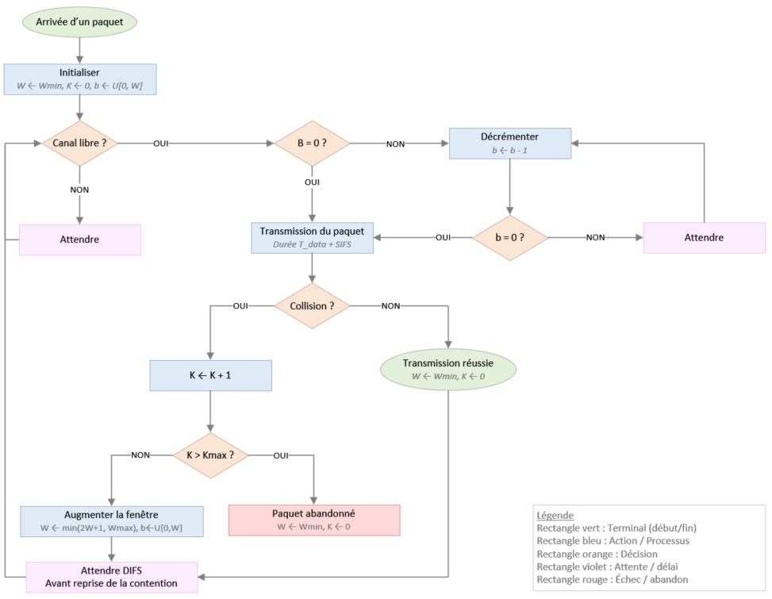

# Simulateur CSMA/CA à événements discrets

[](https://github.com/moyamelissa/Mobile-Networks-and-Wireless-Communications/actions)
[]()
[]()


## Présentation

Ce projet propose un simulateur à événements discrets du protocole CSMA/CA (Carrier Sense Multiple Access with Collision Avoidance), utilisé dans les réseaux Wi-Fi IEEE 802.11.  
Le programme modélise plusieurs stations partageant un canal et permet d’analyser :

- le débit (bits/s)
- le taux de collision
- le délai moyen

Un mode optionnel RTS/CTS est disponible pour comparaison.
Conformément à l'énoncé, chaque station MAC ne traite qu'un seul paquet à la fois : une nouvelle arrivée n'est planifiée qu'après la réussite ou l'abandon du paquet courant.

Un script d'automatisation (`tools/run_experiments.py`) permet de reproduire l'ensemble des expériences et de générer automatiquement les fichiers CSV et les graphiques.

La génération des graphiques SVG est assurée par `tools/plot.py`, l'affichage console par `tools/print_result.py` et l'export CSV par `tools/save_csv.py` — tous importés automatiquement par le simulateur.

Les résultats des simulations sont enregistrés dans le répertoire `data/` (CSV), tandis que les graphiques correspondants sont générés dans le répertoire `figures/`.

---

## Installation

Aucune dépendance externe requise pour exécuter les simulations (bibliothèque standard Python 3.8+ uniquement).

Pour les tests unitaires uniquement :

```bash
pip install -r requirements-dev.txt
```

---

## Utilisation rapide

Simulation simple :

```bash
python csma_ca_sim.py --stations 4 --arrival-rate 20 --simulation-time 5
```

Avec le mode RTS/CTS :

```bash
python csma_ca_sim.py --stations 8 --arrival-rate 50 --rtscts
```

Reproduire toutes les expériences du rapport :

```bash
python tools/run_experiments.py
```

---

## Paramètres principaux

| Paramètre             | Description                                              |
|-----------------------|----------------------------------------------------------|
| `--stations`          | Nombre de stations en compétition                        |
| `--arrival-rate`      | Taux d'arrivée des paquets par station (paquets/s)       |
| `--simulation-time`   | Durée totale de la simulation (secondes)                 |
| `--wmin`, `--wmax`    | Fenêtre de contention minimale et maximale (backoff)     |
| `--kmax`              | Nombre maximal de retransmissions avant abandon          |
| `--rtscts`            | Active le mode RTS/CTS                                   |
| `--seed`              | Graine aléatoire pour la reproductibilité                |
| `--runs`              | Nombre de répétitions (résultats moyennés)               |
| `--sweep-stations`    | Balayage du nombre de stations (début fin pas)           |
| `--sweep-wmin`        | Balayage de W_min (début fin pas)                        |
| `--sweep-kmax`        | Balayage de K_max (début fin pas)                        |
| `--output`            | Chemin du fichier SVG généré                            |

---

## Tests

Lancer les tests unitaires :

```bash
python -m pytest test_csma_ca_sim.py
```

Avec couverture de code :

```bash
python -m pytest test_csma_ca_sim.py --cov=csma_ca_sim --cov-report=term-missing
```

---

## Diagramme de fonctionnement



---

## Structure du projet

```
csma_ca_sim.py         # Simulateur principal (CSMA/CA, BEB, RTS/CTS)
test_csma_ca_sim.py    # Suite de tests (103 tests, couverture 100 %)
tools/
    __init__.py        # Marqueur de package Python
    plot.py            # Génération des graphiques SVG
    print_result.py    # Affichage console des résultats de simulation
    save_csv.py        # Export CSV (mode balayage et simulation unique)
    run_experiments.py # Script de reproduction des 5 expériences du rapport
data/                  # Données CSV brutes des expériences
figures/               # Graphiques SVG générés (5 scénarios)
assets/                # Diagramme de fonctionnement (BEB flowchart)
requirements-dev.txt   # Dépendances de développement (pytest, pytest-cov)
README.md              # Ce fichier
```

---

Version finale – 2026 – Projet académique, Réseaux Mobiles et Communications Sans Fil
