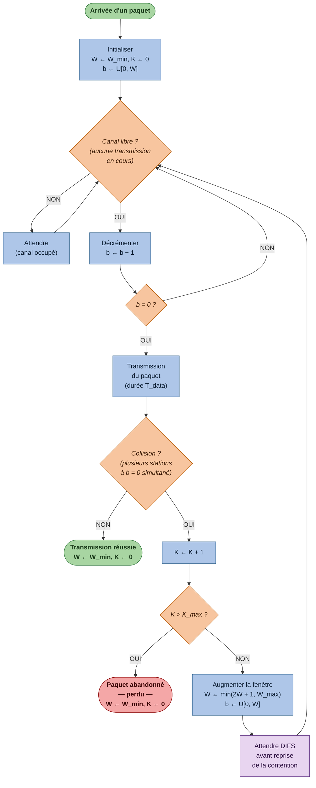
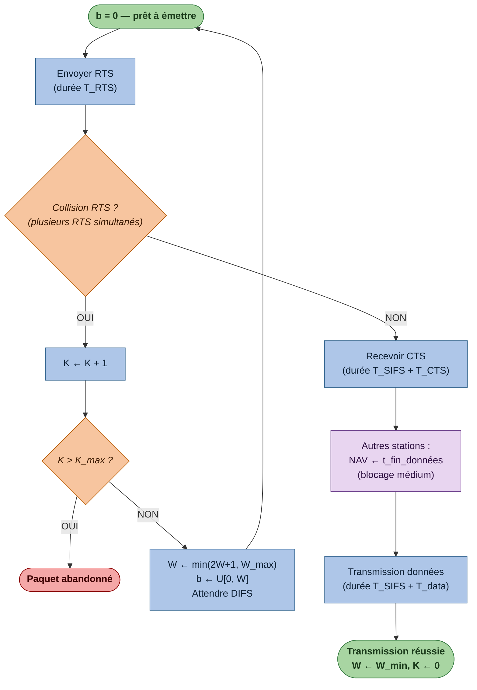

# Figure 2 — Protocole CSMA/CA avec backoff exponentiel binaire

> **Rendu** : ce fichier s'affiche avec les diagrammes dans VS Code (extension *Markdown Preview Mermaid Support*) et sur GitHub.  
> **Pour Visio** : utilisez le tableau de correspondance des formes en bas de page.

---

## Diagramme principal (mode de base, sans RTS/CTS)

---

## Extension RTS/CTS (mode optionnel)

---

## Correspondance des formes pour Visio

| Couleur / style dans le diagramme | Forme Visio recommandée | Remplissage | Exemples de nœuds |
|---|---|---|---|
| **Vert** — ovale | **Terminateur** (début / fin) | `#a8d5a2` (vert pastel) | Arrivée d'un paquet, Transmission réussie, Paquet abandonné |
| **Bleu** — rectangle | **Processus / Action** | `#aec6e8` (bleu pastel) | Initialiser, Décrémenter b, Transmission du paquet, K ← K + 1 |
| **Orange** — losange | **Décision** | `#f7c59f` (orange pastel) | Canal libre ?, b = 0 ?, Collision ?, K > K_max ? |
| **Violet** — rectangle | **Délai / Attente** | `#e8d5f0` (violet pastel) | Attendre DIFS, NAV ← t_fin |
| **Rouge** — ovale | **Fin d'erreur** | `#f4a7a7` (rouge pastel) | Paquet abandonné (RTS/CTS) |

### Polices et flèches recommandées pour Visio
- Police : **Calibri 10 pt**, centré dans la forme
- Flèches : connecteurs droits, étiquette **OUI / NON** en Calibri 9 pt italique sur la branche
- Largeur de forme : processus 3,5 cm × 1,2 cm / décision 3 cm × 1,5 cm / terminateur 3 cm × 0,9 cm (rayon 0,45 cm)
- Espacement vertical entre formes : 1 cm

---

*Référence code : `_handle_slot_tick`, `_handle_data_end`, `_handle_rts_end`, `_prime_station_for_contention` dans `csma_ca_sim.py`*
